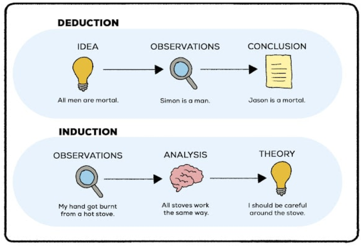
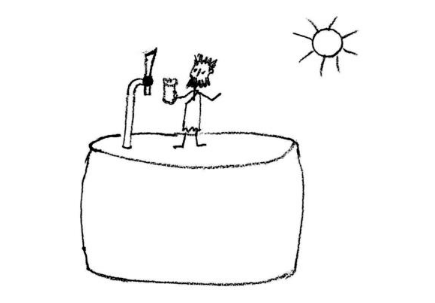
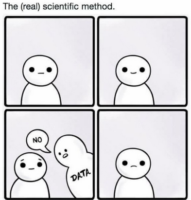

## Induction and Deduction. And science

You are all students of science. But have you ever thought of what actually is the aim of science? Probably, we can all agree that the aim of science is to increase human knowledge. But how this is done? We may think that adding new pieces of knowledge to what is already known is actually the process of science. These new pieces come in the form of universal statements (laws; theories) describing natural processes.

Some scientific disciplines, including biology, use data or experience to increase current knowledge and are thus called empirical science. Intuitively, we may assume that the new pieces of knowledge are first collected as the newly gathered experience or data (singular observations, statements) from which the theories and hypotheses (universal statements) are built.

Statistics should then be the language of empirical science to summarize the data and make the inference of universal statements from the singular ones. This approach to empirical science would be called induction (Fig. 1.1). Despite being intuitive, it is ***not*** the approach we use in modern science to increase knowledge.

## How do we recognize the truth?

We may also agree that only true universal statements or theories represent a real addition to knowledge and may be used to infer correct causal explanations. So, we should aim at truth, which should be an essential aspect of our scientific work. But how does science and scientists recognize the truth of their theories? This is not an easy task. Truth can be defined as a correspondence of statements with the facts[^1]. But the question is how to measure such correspondence. There are two apparent ways:

[^1]: Plato: Republic (Book VII)

1.  We can believe authorities who may issue a judgement on this. The authorities may be of various kind: experienced scientists, distinguished professors, priests or books written by them (note that this is well compatible with the accumulative process of science described above).

2.  We can believe that truth is manifest – that truth is revealed by reason and everybody (who is not ignorant) can see it.

The first way was largely applied in the Middle Age with the church, priests and the Bible as the authorities and ultimate source of truth. This led to a long-term stagnation of science and a few guys burnt at the stake. The second approach stems from the Renaissance thinking revolving against the dogmatic doctrines of the church. It was a foundation of many great discoveries made since the Renaissance time.

Unfortunately, there is also devil hidden in this approach to truth. It lies in the fact that if truth is manifest, then those who cannot see it are either ignorant, or worse, pursue some evil intentions. Declaring itself as the only science-based approach to the society and politics, the Marxist-Leninist doctrine largely relies on the belief that its truth is obvious, which also provided justification for the ubiquitous cruel handling of its opponents whenever possible.[^2],[^3]

[^2]: Popper KR: Conjectures and Refutations

[^3]: Popper KR: Logic of Scientific Discovery

## The search for failure

It seems that we have a problem with truth and need to find the way out of it. The solution of the problem was summarized the philosopher of science Karl R. Popper (1902-1994). Popper states that although truth exists and we should pursue it, we can never be sure that our theories are true. This is because we are prone to make mistakes with the interpretation of what our senses tell us. This view is not that novel as K.R. Popper himself refers to ancient Greek philosophers some of whom have identified this paradox of truth.

One illustrative account of this is the story of prisoners in cave contained in Plato’s Republic. This is the story about prisoners who are kept in a cave from the very beginning of their life and have their heads fixed to look at a wall. Fire is located far behind them and persons and objects pass between the fire and the prisoners’ back casting shadows on the wall, which the prisoners can see. Then, as Plato says (by the speech of Socrates): “To them, I said, the truth would be literally nothing but the shadows of the images.”. In this writing, Plato also declares ourselves to be like these prisoners. This may seem strange as we tend to believe that what we see is real but consider e.g. the recent observation of gravitational waves. We observe them by super-complicated and ultra-sensitive devices and can only see shadows of them (nobody can see them directly).

::: callout-note
## Misleading empirical experience

1.  Ancient greek philosopher Anaximandros (ca 610-546 BC) was the first who identified the Earth as an individual celestial body and presented the first cosmology. This was a great achievement of human reason. However, he supposed the Earth to be barrel shape because he only could see flat world around him - as we actually do (Fig. 1.2).

    

2.  Jean-Baptiste Lamarck (1744-1829) formulated the first theory based on his naturalist experience with adaptations of organisms to their environment. He asserted tat organisms adapt to environment. He asserted that organisms adapt to their environment by adjustments of their bodies, which changes are inherited by the offspring. This is very intuitive but demonstrated to be false by a long series of experimental testing.
:::

## Understanding shadows

Although we can only see shadows of reality, these shadows still contain some information. We can actually use this information to make *estimates* about the reality and more importantly to demonstrate our universal statements ***false***. The ability to demonstrate some theories and hypotheses *false* is the principal strength of empirical science. This leads to rejection of theories demonstrated not to be true while those, for which the falsifying evidence is not available (yet) are retained.

If a theory is rejected on the basis of falsifying evidence, a new one can be suggested to replace the false theory, but note, that this new theory is never produced by an “objective” process based on the data. Instead, it is produced by subjective human reasoning (which aims to formulate the theory not to be in conflict with objective facts though).

## 404 Truth Not Found

In summary, experience can tell us that a theory is wrong but no experience can prove truth of a theory (note here, that we actually do not use the word “proof” in terminology of empirical science).

Consider e.g. the universal statement “All plants are green”. It is not important how many green plants you observe to prove it true. Instead, observation of e.g. single non-green parasitic *Orobanche* (Fig. 1.3) is enough to demonstrate that it is false.

Our approach of doing science is thus *not based on induction*. Instead it is *hypothetical-deductive* as we formulate hypotheses and from them deduce how world should look like if the hypotheses were true (Fig. 1.4). If such predictions can be *quantified*, their (dis)agreement with the reality can be measured by statistics. The use of statistics is however not limited to hypothesis testing. We also use statistics for *data exploration* and for *parameter estimates*.

Finally, you may wonder how *Biostatistics* differs from *Statistics* in general. Well, there no fundamental theoretical difference, Biostatistics refers to application of statistical tools in biological disciplines. Biostatistics generally acknowledges, that biologists mostly fear math so much that the mathematical roots of statistics are not discussed in details and also e.g. complicated formulae are avoided wherever possible.

::: callout-note
## Prisoners in cave[^4]

Socrates - GLAUCON

And now, I said, let me show in a figure how far our nature is enlightened or unenlightened: --Behold! human beings living in a underground den, which has a mouth open towards the light and reaching all along the den; here they have been from their childhood, and have their legs and necks chained so that they cannot move, and can only see before them, being prevented by the chains from turning round their heads. Above and behind them a fire is blazing at a distance, and between the fire and the prisoners there is a raised way; and you will see, if you look, a low wall built along the way, like the screen which marionette players have in front of them, over which they show the puppets.

I see. And do you see, I said, men passing along the wall carrying all sorts of vessels, and statues and figures of animals made of wood and stone and various materials, which appear over the wall? Some of them are talking, others silent.

You have shown me a strange image, and they are strange prisoners.

Like ourselves, I replied; and they see only their own shadows, or the shadows of one another, which the fire throws on the opposite wall of the cave?

True, he said; how could they see anything but the shadows if they were never allowed to move their heads?

And of the objects which are being carried in like manner they would only see the shadows?

Yes, he said. And if they were able to converse with one another, would they not suppose that they were naming what was actually before them?

Very true. And suppose further that the prison had an echo which came from the other side, would they not be sure to fancy when one of the passers-by spoke that the voice which they heard came from the passing shadow?

No question, he replied. To them, I said, the truth would be literally nothing but the shadows of the images.

That is certain. And now look again, and see what will naturally follow it' the prisoners are released and disabused of their error. At first, when any of them is liberated and compelled suddenly to stand up and turn his neck round and walk and look towards the light, he will suffer sharp pains; the glare will distress him, and he will be unable to see the realities of which in his former state he had seen the shadows; and then conceive some one saying to him, that what he saw before was an illusion, but that now, when he is approaching nearer to being and his eye is turned towards more real existence, he has a clearer vision, -what will be his reply? And you may further imagine that his instructor is pointing to the objects as they pass and requiring him to name them, -will he not be perplexed? Will he not fancy that the shadows which he formerly saw are truer than the objects which are now shown to him?

Far truer. And if he is compelled to look straight at the light, will he not have a pain in his eyes which will make him turn away to take and take in the objects of vision which he can see, and which he will conceive to be in reality clearer than the things which are now being shown to him?

True, he now And suppose once more, that he is reluctantly dragged up a steep and rugged ascent, and held fast until he 's forced into the presence of the sun himself, is he not likely to be pained and irritated? When he approaches the light his eyes will be dazzled, and he will not be able to see anything at all of what are now called realities.

Not all in a moment, he said. He will require to grow accustomed to the sight of the upper world. And first he will see the shadows best, next the reflections of men and other objects in the water, and then the objects themselves; then he will gaze upon the light of the moon and the stars and the spangled heaven; and he will see the sky and the stars by night better than the sun or the light of the sun by day?

Certainly. Last of he will be able to see the sun, and not mere reflections of him in the water, but he will see him in his own proper place, and not in another; and he will contemplate him as he is.

Certainly. He will then proceed to argue that this is he who gives the season and the years, and is the guardian of all that is in the visible world, and in a certain way the cause of all things which he and his fellows have been accustomed to behold?

Clearly, he said, he would first see the sun and then reason about him.

And when he remembered his old habitation, and the wisdom of the den and his fellow-prisoners, do you not suppose that he would felicitate himself on the change, and pity them?

Certainly, he would. And if they were in the habit of conferring honours among themselves on those who were quickest to observe the passing shadows and to remark which of them went before, and which followed after, and which were together; and who were therefore best able to draw conclusions as to the future, do you think that he would care for such honours and glories, or envy the possessors of them? Would he not say with Homer,

Better to be the poor servant of a poor master, and to endure anything, rather than think as they do and live after their manner?

Yes, he said, I think that he would rather suffer anything than entertain these false notions and live in this miserable manner.

Imagine once more, I said, such an one coming suddenly out of the sun to be replaced in his old situation; would he not be certain to have his eyes full of darkness?

To be sure, he said. And if there were a contest, and he had to compete in measuring the shadows with the prisoners who had never moved out of the den, while his sight was still weak, and before his eyes had become steady (and the time which would be needed to acquire this new habit of sight might be very considerable) would he not be ridiculous? Men would say of him that up he went and down he came without his eyes; and that it was better not even to think of ascending; and if any one tried to loose another and lead him up to the light, let them only catch the offender, and they would put him to death.

No question, he said. This entire allegory, I said, you may now append, dear Glaucon, to the previous argument; the prison-house is the world of sight, the light of the fire is the sun, and you will not misapprehend me if you interpret the journey upwards to be the ascent of the soul into the intellectual world according to my poor belief, which, at your desire, I have expressed whether rightly or wrongly God knows. But, whether true or false, my opinion is that in the world of knowledge the idea of good appears last of all, and is seen only with an effort; and, when seen, is also inferred to be the universal author of all things beautiful and right, parent of light and of the lord of light in this visible world, and the immediate source of reason and truth in the intellectual; and that this is the power upon which he who would act rationally, either in public or private life must have his eye fixed.

I agree, he said, as far as I am able to understand you.

….
:::

[^4]: Plato: Republic (Book VII)
