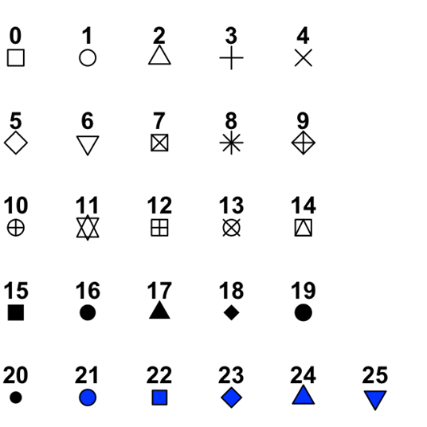

## Why graphs?

Graphs represent a crucial tool in statistical analysis**. They are used for exploratory data analysis, parameter comparisons between samples, and illustrations of associations between variables.** A number of graph types exist, which are suitable for different purposes. They are very useful for communication, including also data/analysis result presentation.

Most people simply prefer seeing a graph to studying numbers presented in a table. Producing nice graphs is thus an important part of presentation of scientific results[^1]. There are no universal rules how a nice graph should look like, but the good thing is that the quality of your graphs will quickly improve with practice and experience. Getting inspired by graphical presentations of other researchers is also very helpful.

[^1]: Most readers of scientific papers only read the abstract and then look at the figures; and all of them do this before deciding whether the paper is worth of further reading. This applies also for journal editors and submitted manuscript. Figure quality and attractiveness may thus have a decisive effect on the editor’s decision on publication.

An important aspect of the graphs is that they cannot display all the information contained in the raw data. An ideal graph should minimize this loss of information while efficiently depicting the patterns of interest. These requirements are however often in conflict. A reasonable solution often lies in providing the reader both the graph and the raw data (attached as supplementary material or deposited in a public repository such as [Dryad](https://datadryad.org/stash) or [Zenodo](https://zenodo.org/)).

Many scientific journals nowadays require disclosure of the original data anyway, which is important for checking the integrity of the analyses presented. **By contrast, presenting the same descriptive statistics in both table and graph format is generally considered superfluous and should be avoided.**

## Basic graph types

| Graph type | Number of variables[^2] | Preservation of information | Display of sample parameters | Visualization of dependence |
|----|----|----|----|----|
| Histogram | 1 | ++ | -- | -- |
| Boxplot | 1 quantitative + 1 categorical | \+ | \- | \+ |
| Barplot (counts) | 1 or 2 categorical | \+ | -- | \+ |
| Dotchart (with errorbars) | 1 quantitative + 1 categorical | -- | ++ | ++ |
| Scatterplot | 2 quantitative | ++ | \- | ++ |

: Table 1: Summary of basic graph types, their advantages and limitations. ++ excelent, + good, - still adequate, – poor.

[^2]: Refers to a minimum (typical) number. May be increased, e.g. by combining multiple categorical predictors, or categorization of point in a scatterplot.

## Graph plotting in R

Two most common include the **R base graphics** and **the package ggplot2**. Both approaches have their advantages and disadvantages. The R base graphics uses the same script grammar as the rest of R. Thus, you do not need to study another specialized package. However, plotting complicated plots may require quite a lot of programming. Producing graphically nice outputs may also require adjustments of many parameters in some (albeit not all) graph types.

The ggplot2 package uses its own script grammar, which is quite different from R base. This means that you need to study another programming language. However, with this language you can easily plot complicated graphs with just two lines of code (instead of 20 in base graphics). In this material, we take things pragmatically. Generally, ggplot is in the focus as a modern tool of graph plotting. However, if it easier to to produce a particular graph type with base graphics, we choose that way.

### The `ggplot` grammar

Each definition of a ggplot graph starts with the `ggplot()` function, which defines the data (i.e. data frame where to look for variables) and so called `aesthetics mappings`, which are definition of variables used for plotting.

Let's define a simple scatterplot for a data frame called df with variables x and y:

```{r}
#| warning: false
# Call library ggplot or tidyverse (which includes gpglot package)
library(tidyverse)

# Prepare df
df <- data.frame(
  x = rnorm(30, mean = 10, sd = 1),
  y = rnorm(30, mean = 20, sd = 5)
)

# Initial function ggplot
ggplot(data = df, mapping = aes(x = x, y = y)) +
  
  # geom_point function plotting scatterplot connected by '+'
  geom_point()
```

Other elements or arrangements of plot are specified by additional functions added with another `+`. The most essential among these are:

-   `theme()` – setting visual attributes; There are preset graphical themes. I really prefer `theme_classic()` or `theme_bw()` to the default `theme_gray()`

-   `labs()` – specification of axis label text - `facet_wrap()` – faceting graphs, i.e. defining multipanel plots with panels based on a variable

-   `grid.arrange()` (package `gridExtra`), package `patchwork`, `ggarrange()` from the package `ggpubr` – creating general multipanel plots

-   `ggsave(filename, width, height, units, dpi, ...)` – saves the most recent plot to hard drive (height and width are specified in cm). File type (.pdf, .svg, .png) is automatically set by file extension.

For ggplot2, there is abundant reference available, such as:

-   a free [online book](https://ggplot2-book.org/index.html) (printed version for \$\$)

-   [ggplot2 cheat sheet](https://raw.githubusercontent.com/rstudio/cheatsheets/main/data-visualization.pdf)

-   If you are looking for inspiration [R Graph Gallery](https://r-graph-gallery.com/ggplot2-package.html) is also useful

-   You can also find valuable reference or guidelines by Google searches such as “scatterplot in ggplot”

-   Lesson **Data visualisation** from the course *Data Manipulation and Visualisation* available on this website

-   AI chatbots have mastered the ggplot and for some extra specific stuff they cab be more useful than standard googling

### Base R graphics

The R base graphics uses the common R grammar:

```{r}
par(mfrow = c(1,2))
# classical parameters
plot(x = df$x, y = df$y)

# formula grammar (y depends on x)
plot(y ~ x, data = df)

par(mfrow = c(1,1))
```

For the base R graphics, there is also a [cheat sheet](http://publish.illinois.edu/johnrgallagher/files/2015/10/BaseGraphicsCheatsheet.pdf) available as well as abundant online resources. R help is in general quite informative. Info on parameters of graphical functions can be called by `?par`.

To export plots produced by R graphics, you need to define a graphical device in a file, draw the plot there and save the file, so basically **3 lines** of code:

```{r}
#| eval: false
pdf('filename.pdf', width = 10, height = 6) # Creates the file – width and height are in inches (vector graphics: .pdf, .svg) or in pixels (raster graphics – .png, .jpg, .tif)

plot(y ~ x, data = df) # Draws the plot

dev.off() # Closes the path opened by pdf() and saves the file.
```

#### Histogram

Histogram was already introduced in **Chapter 2**. The construction of histograms is done in two steps. The range of values is first divided into a number of intervals of defined width (called bins). These are plotted on the x-axis.

Individual values are then assigned into them and the resulting frequencies of observations are plotted on the y-axis. Thus, histograms display the data with only minimal loss of information. They are a perfect tool for exploration of data distribution.

```{r}
#| fig-cap: "Figure 1: Histogram of the variable xy$y plotted by base R."

# Load data to R
xy <- read_csv('data/03_xy.csv')

# Plot histogram
hist(xy$y)
```

#### Boxplot

Boxplot was also introduced in **Chapter 2**. Boxplots display a summary of descriptive statistics of samples: **median**, **quartiles**, **non-outlier range** and **outliers**. Typically, they are used to study association between a categorical (factor) and a quantitative (numeric) variable, where they display differences between individual categories (levels). **Boxplots do not display means**, so it is not possible to use them for direct mean comparisons. However, crucial characteristics of the distributions are visible on the plots: variability, symmetry, presence of outliers. This makes boxplots an important tool for *exploratory data analysis*.

```{r}
#| fig-cap: "Figure 2: Boxplot displaying the values of the variable y for individual categories of the variable type. Note the non-symmetric distributions and the outliers."

# Boxplot in base R
boxplot(y ~ type, data = xy, main = 'Base R')
```

```{r}
#| fig-cap: "Figure 3: Boxplot displaying the values of the variable y for individual categories of the variable type. Note the non-symmetric distributions and the outliers."

# Boxplot with ggplot
ggplot(data = xy,
       mapping = aes(x = type, y = y)) +
  geom_boxplot(fill = 'grey') +
  labs(title = 'ggplot') +
  theme_classic()
```

#### Barplot

Barplot is an efficient graphical tool to display **counts of a categorical variable**[^3]. Multiple categorical variables may also be combined to define types of observations.

[^3]: Common misunderstanding is that barplot is the same thing as histogram. Albeit in both cases you need to define just the x-axis variable; it is not true. **Histogram** is used for displaying frequencies of values on **quantitative** scale (chopped into bins of defined range). **Barplot** is used for displaying counts of levels of **categorical** variables (factors).

```{r}
#| fig-cap: "Figure 4: Stacked and dodged barplots displaying counts of conference participants categorized by their country of origin and position held."
#| fig-width: 7
#| fig-height: 7
# Create tibble
positions <- tribble(
  ~Country,   ~Position,   ~count,
  "Austria",  "Postdoc",   6,
  "Austria",  "Professor", 4,
  "Austria",  "Student",   8,
  "Czechia",  "Postdoc",   4,
  "Czechia",  "Professor", 1,
  "Czechia",  "Student",   14,
  "Denmark",  "Postdoc",   0,
  "Denmark",  "Professor", 1,
  "Denmark",  "Student",   4,
  "Hungary",  "Postdoc",   4,
  "Hungary",  "Professor", 5,
  "Hungary",  "Student",   14,
  "Slovakia", "Postdoc",   2,
  "Slovakia", "Professor", 2,
  "Slovakia", "Student",   14) |> 
  uncount(count)

# Barplot - stacked
a <- ggplot(data = positions) +
  geom_bar(aes(x = Country, fill = Position)) +
  theme_classic()

# Barplot - dodged
b <- ggplot(data = positions) +
  geom_bar(aes(x = Country, fill = Position), position = 'dodge2') +
  theme_classic()

# Create plot panel
library(ggpubr)
ggarrange(a, b, ncol = 1)
```

::: callout-tip
## Barplot arrangement

Note that the combination of the two categorical variables is done by defining one as `x` and the other as `fill`. The position parameter in geom_bar may be `stacked`, `dodge` or `dodge2`. Producing the upper panel of Fig. 4.3 however required a bit more complicated `geom_bar(position = 'dodge2')` because of the zero postdocs from Denmark.
:::

#### Dotchart

Dotchart can be used to display **means of quantitative variables**, in particular differences between means of individual categories (factor levels). To judge the difference between means, it is necessary to display also a **characteristic of uncertainty of mean estimate or variability**. Therefore, dotcharts should be supplied by **error bars** displaying **standard errors of the mean**, **confidence intervals** or **standard deviations**.

Of these, the general best choice is probably the confidence intervals, which indicates the range of values within which the (true) population mean lies with 95% probability (more on that in **Chapter 7**).

In any case, **specification of error bars (what they display) must always be included in a graph caption**. The strong aspect of dotcharts is that they allow judging on differences between means. However, this comes with substantial loss of information as dotcharts do not display the distribution at all and may even be misleading in this respect.

```{r}
#| fig-cap: "Figure 5: Dotchart displaying mean values of variable y2 for individual categories of type.1. Error bars indicate 1 standard error."

# Dotchart
ggplot(xy, aes(x = type, y = y)) +
  stat_summary(fun.data = mean_se, geom = 'pointrange') +
  theme_classic()
```

::: callout-tip
## Calculation within `ggplot`

The layer is defined by a `stat_*()` function here, which produces a statistical summary of the data (as opposed to `geom_*()` functions which need to be supplied by the data for direct plotting). In this case (which is applicable in general):

-   `stat_summary(fun.data = mean_se, geom = 'pointrange')`

-   `fun.data` may be `mean_se` (mean +- standard error), `mean_cl_normal` (95%-confidence interval), or `smean_sdl` (standard deviation)

-   `geom = "pointrange"` defines the geom function used for plotting
:::

#### Scatterplot

Scatterplot is a simple point-based plot illustrating the association between two quantitative variables. The points in scatterplot usually represent original data, thus there is little loss of information, if any. Scatterplot is perfect for exploration of interdependence between two variables. Regression line (with confidence intervals) may also be added to the raw scatterplot to visualize a regression model (see chapter 10 for details).

```{r}
#| fig-cap: "Figure 6: Scatterplots displaying the relationships between x and y. An additional categorical variable can be displayed by point colours."
#| fig-width: 7
#| fig-height: 7
# Scatterplot
aa <- ggplot(xy, aes(x = x, y = y)) +
  geom_point() +
  labs(title = 'Simple scatterplot') +
  theme_classic()

ab <- ggplot(xy, aes(x = x, y = y, colour = type)) +
  geom_point() +
  labs(title = 'Scatterplot categorized by type') +
  theme_classic()

#library(ggpubr)
ggarrange(aa, ab, ncol = 2)
```

::: callout-note
## Static vs. dynamic parameters

Generally, if you want some parameter to be **dynamic**, e.g., the colour/fill/shape of points should **change based on some variable**, it must be included as a parameter in the `aes()` function.

If you just want all points to be **static** e.g., regardless what, all should be just red, it must be defined **outside** the `aes()` function, but still within the `ggplot()` or particular `geom_` or `stat_` function. The arguments are usually the same in `aes()` and `ggplot()` functions.
:::

## Facetting

Facetting is a powerful tool to display **dependence of two variables at different levels of a factor**. It may often be better than displaying colours.

```{r}
#| fig-cap: "Figure 7: Faceted scatterplot showing the relationships between x and y at different levels of Type."
ggplot(xy, aes(x = x, y = y)) +
  geom_point() +
  facet_wrap(vars(type)) +
  theme_bw()
```

## Colours, fills, shapes, sizes, palettes...

Now, when you have read the basic overview about what kind of plots are possible to create in R, you may be wondering if they can be nicer than grey. There are plenty of ways to customize your plots and now we will look more into it.

The first thing that will save you from many futile trials and errors is knowing the difference between **static** and **dynamic** parameters. If you want to set all points or lines or whatever to have the same colour, shape or size, this is defined as a **static** parameter.

If you want to change colours, sizes of points or point shapes according to some third variable (i.e. column) in your dataset, you must define it as a **dynamic** parameter. Dynamic parameters may reflect a categorical but also continuous variable that is not displayed directly on the x or y axis, but it may be useful to see also this information.

For example, you want to display the dependence of the number of pollinators (y) on the size of flowers (x), but it will be also useful to know which species they were (the third categorical variable), you can symbolize each point by different colour depending on what species the flower was.

```{r}
#| warning: false
#| fig-cap: "Figure 8: Examples of statically and dynamically set variables."
#| fig-width: 10
#| fig-height: 6
# We will demonstrate static and dynamic parameters on the starwars dataset available in the package dplyr
data("starwars")

p1 <- starwars |> 
  ggplot(aes(height, mass)) +
  geom_point(colour = 'red') +
  ylim(20, 160) +
  labs(title = 'Static colour') +
  theme_light()

p2 <- starwars |> 
  ggplot(aes(height, mass)) +
  geom_point(shape = 3) +
  ylim(20, 160) +
  labs(title = 'Static shape') +
  theme_light()

p3 <- starwars |> 
  ggplot(aes(height, mass)) +
  geom_point(aes(colour = sex)) +
  ylim(20, 160) +
  labs(title = 'Dynamic colour - categorical') +
  theme_light()

p4 <- starwars |> 
  ggplot(aes(height, mass)) +
  geom_point(aes(shape = sex)) +
  ylim(20, 160) +
  scale_shape_manual(values = c(0,1,2,3), na.value = 4) +
  labs(title = 'Dynamic shape - categorical') +
  theme_light()

p5 <- starwars |> 
  ggplot(aes(height, mass)) +
  geom_point(aes(colour = birth_year)) +
  ylim(20, 160) +
  scale_color_gradient2(low = 'gold', mid = 'limegreen', high = 'turquoise', midpoint = 450) +
  labs(title = 'Dynamic colour - continuous') +
  theme_light()

p6 <- starwars |> 
  ggplot(aes(height, mass)) +
  geom_point(aes(size = birth_year), shape = 1) +
  ylim(20, 160) +
  labs(title = 'Dynamic shape - continuous') +
  theme_light()

ggarrange(p1, p3, p5,
          p2, p4, p6,
          ncol = 3, nrow = 2,
          align = 'hv',
          legend = 'right')
```

The next thing relates to the way how to define the colours (or sizes or shapes) you want to use. In the case of static parameters, the situation is quite easy. They are set *outside* the `aes()` function within desired `geom_*()` function. All you must do is choose your colour, and then the script will look like this:

```{r}
#| eval: false
ggplot(data = df, aes(x = x, y = y)) +
  geom_point(colour = 'red')
```

In the case of dynamic parameters, it gets a bit complicated. First, you define that the colour will represent some other variable. Setting of a dynamic parameter is done *within* the `aes()` function:

```{r}
#| eval: false
ggplot(data = df, aes(x = x, y = y, colour = your_variable)) +
  geom_point()
```

`your_variable` must be a vector of either a categorical or a continuous variable and which must have the same length as the x and y vectors (or columns if they are organised in a data frame).

If we don’t further define the colours, they are taken from the default R palettes. If you want to use some nicer predefined palette or create your own, you will need another line of script. Let’s say, `your_variable` is a factor with 3 levels. In this case, you use the function `scale_colour_manual()` where you need to define a vector containing 3 colours:

```{r}
#| eval: false
ggplot(data = df, aes(x = x, y = y, colour = your_variable)) +
  geom_point() +
  scale_colour_manual(values = c("orange", "purple", "cyan"))
```

For more scaling functions check the ggplot2 cheatsheet. For colour selection, you may look, what’s in the base R `palette()`, or `colours()` (this is done simply by running these functions). Apart from that, you may look for inspiration into many palette generators available online and take advantage of the R’s ability to read colours also from HEX codes (in this form: “#89BD9E”), e.g.:

-   [Color Brewer 2.0](https://colorbrewer2.org/#type=sequential&scheme=BuGn&n=3)

-   [R Color Brewer](https://r-graph-gallery.com/38-rcolorbrewers-palettes.html)

-   [R Colors](https://r-charts.com/colors/)

-   [Coolors](https://coolors.co/)

-   [Color Hunt](https://colorhunt.co/palettes/)

-   and many more...

Sometimes, if you use some fancy point types, you may run into a problem with “colour” vs. “fill”. There are a few main scaling functions which have many mutations:

-   `scale_colour_*()` colour of point types 0-20 (don’t have fill), outline of point types 21-25

-   `scale_fill_*()` fill of point types 21-25

-   `scale_shape_*()` point types (Figure 8)

-   `scale_size_*()` size of points, can be changed according to both, categorical and continuous variables, but it is more intuitive to use it for continuous variables



And the last thing. It is also useful to know how to adjust labs, axis titles, main title, subtitles and others. Title or lab texts are easily set in the function `labs()`

```{r}
#| eval: false
your_plot + 
  labs(x = "x axis label",
	  y = "y axis label",
		  title = "title above plot")
```

If you would like to change the font colour, face (...) of the texts in your plot, or play more with e.g., axis tick size, colour, labels or whatever you can imagine, it is done within the general `theme()`[^4] function through subfunctions `element_*()`:

[^4]: Not to be confused with the `theme_classic()` or `theme_bw()` functions which are just predefined variants of the generic function `theme()`

```{r}
#| eval: false
your_plot +
  theme(axis.title.y = element_text(),
        plot.title = element_text())
```

As you can see, the ggplot is adjustable to almost infinite number of styles, but usually, you can get a neat plot with the default options and use of predefined themes such as `theme_bw()` or `theme_classic()`, so no need to be afraid that you will spend three days just setting the title font size. :)

That’s it! A little advice in the end. When you know what you want, but don’t know how to do it, there is a great support accessible via a simple Google search. Also, consulting AI turned out to be the relatively straightforward way to fine-tune plots, according to 10 out of 9 master's students.

## Exercises

### Graph plotting workshop I.

0.  Check the Inkscape program (download [here](https://inkscape.org/) and possibly install it on your personal computer later).
1.  Import data describing lettuce varieties (`lettuce.xlsx`) to R
2.  Create histograms of harvest days for both lettuce colors
3.  Create a boxplot of `harvest days ~ leaf color`
4.  Set the color fill of the boxes to light blue
5.  Set the color fill of the boxes to correspond to lettuce leaf color
6.  Create a scatterplot of `harvest mass ~ harvest days`; update the default axis labels
7.  Change the colors of the points to illustrate the leaf color of the variety
8.  Plot a facetted scatterplot with panels (facets) defined by the leaf color variety
9.  Adjust point size
10. Export the graph to pdf/svg/powerpoint/word
11. Import the dataset describing beer types (`beer.xlsx`) and plot a boxplot illustrating the pattern in alcohol content in dependence on beer subtype. Set the box fill according to beer type. Adjust axis labels and the fill legend text.
12. Plot a boxplot illustrating the dependence of beer bitterness (IBU) on beer type and color.

#### Independent tasks

**#AI** Try to produce the plots #11 and #12 using an LLM and get the corresponding R script.

1.  Import the `people2.xlsx` dataset. Draw scatterplots showing the relationships between

    a.  body mass and height, and
    b.  body mass and hours spent exercising

    Illustrate the sex and hair color variables by using different point colors and faceting.

    *At home*: try opening the svg files in Inkscape software and exporting the figures to pdf or png

### Graph plotting workshop II.

1.  Explore the RcolorBrewer color palettes by installing the `RColorBrewer` package, loading it, and running the `display.brewer.all()` function with various parameters

    a.  Try different `n`

    b.  Try specifying `colorblindFriendly = T / F`

2.  Draw a barplot showing the association between lettuce taste classes and leaf color. Try plotting a stacked and dodged barplot and use various color schemes to code the taste variable levels. Display lettuce color on the x-axis and lettuce taste by a color code and vice versa.

3.  Draw dotcharts displaying mean (+- SE) alcohol content and IBU of beer subtypes (dataset `beer.xlsx`).

    a.  Combine them in a single two-panel plot.

    b.  Display ABV by beer subtype by a dotchart and boxplot, and combine them in a single two panel plot.

4.  Download the original data supporting the scientific study on the interaction between invasive and hemiparasitic plants (<https://neobiota.pensoft.net/article/113069/).> The dataset is also available in IS (`data/neobiota-090-097-s002.xlsx`). Import the data in R – check the arguments used in the `read_excel()` function in the script to import the data correctly.

    a.  Plot a boxplot showing the dependence of the host number of shoots (`host_n`) on the infection by hemiparasites (`parasite`). Try log-scaling the y-axis.

    b.  Plot a scatterplot showing the relationship between hemiparasite biomass and host biomass. Use different point symbols for the host species and facets for hemiparasite species. Note that uninfected control observations must be removed from the data before plotting.

**#AI** Try to reproduce any of the tasks 1-4 with your favourite LLM. Get the R code from the LLM.

#### Independent work

1.  With the data used in task 4:
    a.  Plot a dotchart showing means +- SE to illustrate the dependence of the host number of shoots (`host_n`) on the infection by hemiparasites (`parasite`). Compare plots with linear and log10-scaled y-axis.
    b.  Plot a dotchart (means +- SE) and a boxplot illustrating the dependence of host biomass (`host_g`) on the infection by hemiparasites (`parasite`). Arrange the two graphs in a single twopanel figure.
2.  Plot a scatterplot displaying the association between beer alcohol content and bitterness. Illustrate the primary beer type using different symbols.
