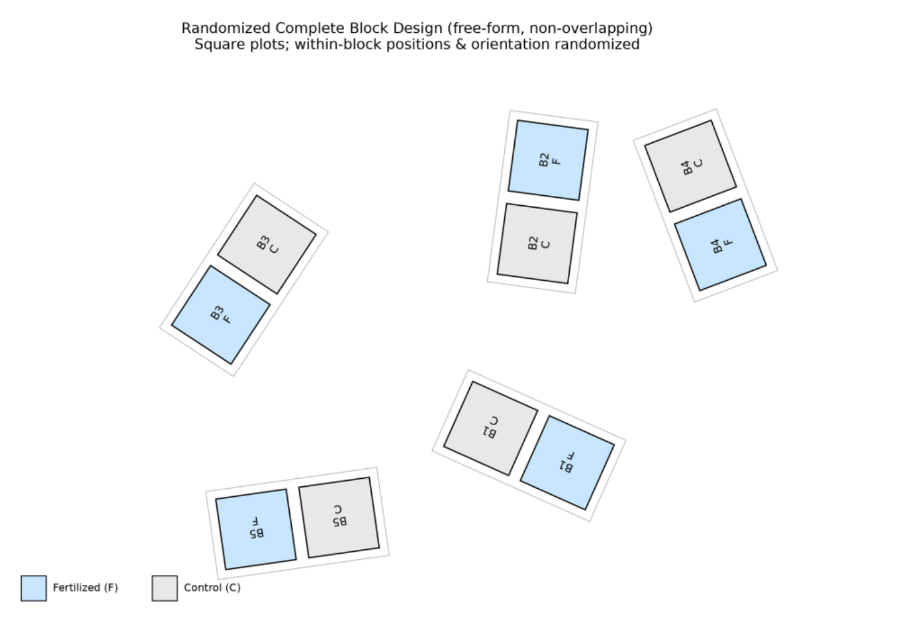

## The t-distribution

For any fixed value X, a t-value can be computed from a sample of a quantitative random variable using this formula: $$
t = \frac{X - \overline{x}}{s_{\overline{x}}}
$$ where $\overline{x}$ is the **sample mean** and $s_\overline{x}$ is its associated **standard error**. Recall here, that $\overline{x}$ is the *estimate* of the population mean and $s_{\overline{x}}$ quantifies its accuracy. As a result, the ***t-value*** **represents the estimate of the difference between** $X$ **and the population mean**.

Because $\overline{x}$ is a random variable, *t-value* is also a random variable and its probability distribution is called the ***t-distribution***. Its shape is closely similar to $Z$ (standard normal distribution with $\mu = 0$ and $\sigma^2 = 1$). In contrast to $Z$, the *t-distribution* has a single parameter – **the number of degrees of freedom**, which equals the $number\ of\ observations\ in\ a\ sample - 1$. In fact, $t$ approaches $Z$ asymptotically for high DF (**Figure 1**). Similarly to the normal distribution, the t-distribution is symmetric, and its two tails must be considered when computing probabilities (**Figure 2**).

```{r}
#| code-fold: true
#| code-summary: "Show R Script"
#| fig-cap: "Figure 1: Probability density plot of t-distributions with different DF and their comparison to standard normal distribution (Z). Notice how t-distribution approaches Z distribution with increasing df."

# t(df = 10)
curve(dt(x, df = 10), col = 'green', xlim = c(-5, 5), 
      xlab = 't', ylab = 'Probability density',
      main = 'Probability density of t and Z')
text(x = 1.8, y = 0.28, label = 't(df = 10)', col = 'green')

# t(df = 3)
curve(dt(x, df = 3), add = T, col = 'red')
text(x = 2, y = 0.22, label = 't(df = 3)', col = 'red')

# t(df = 1)
curve(dt(x, df = 1), add = T, col = 'black')
text(x = 2.3, y = 0.16, label = 't(df = 1)', col = 'black')

# Z(mu = 0, sd = 1)
curve(dnorm(x, mean = 0, sd = 1), col = 'blue', add = T)
text(x = 1.3, y = 0.35, label = 'Z(0,1)', col = 'blue')
```

```{r}
#| code-fold: true
#| code-summary: "Show R Script"
#| fig-cap: "Figure 2: The t-distribution with its two tails and the 2.5% and 97.5% quantiles."
# curve for t(df = 5)
curve(dt(x, df = 5), xlim = c(-5, 5), col = 'red',
      xlab = 't', ylab = 'Probability density', main = 't(df = 5)')

# zero
abline(h = 0, lty = 2)

# maximum probability line
abline(v = 0, lty = 2)

# 2.5% quantile
abline(v = qt(p = 0.025, df = 5), lty = 2, col = 'green')

# 97.5% quantile
abline(v = qt(p = 0.975, df = 5), lty = 2, col = 'green')

# text labels
text(x = -3.95, y = 0.1, labels = 'p(t < T) = 0.025', col = 'green')
text(x = 3.95, y = 0.1, labels = 'p(t < T) = 0.975', col = 'green')
```

## Confidence intervals for the mean value

The t-distribution can be used to compute **confidence intervals** (CI), i.e. intervals within which the population mean value lies with a certain probability (usually 95%). The *confidence limits* (CL) within which the CI lies are determined using these formulae: $$
CL_{low} = \overline{x} - t_{(df,\ p = 0.025)}s_{\overline{x}}
$$

$$
CL_{high} = \overline{x} + t_{(df,\ p = 0.025)}s_{\overline{x}}
$$

where $t(df,\ p)$ equals 2.5% or 97.5% probability quantile of t-distribution with given df and $s_{\overline{x}}$ is the standard error of the sample mean. These intervals can be used as error bars in barplots or dotcharts. In fact, they represent the best option to be used like this (in contrast to standard error or 2\*standard error).

## Single sample t-test

Confidence intervals can also be used to determine whether the population mean differs significantly from a given value: a value lying outside the CI is significantly different (at 5%-level of significance) while a value lying inside is not. This is closely associated with the **single sample t-test**, which tests a *null hypothesis* that a value $X$ equals the population mean. Using the formula for t-value and DF, the t-test determines the probability of Type I Error associated with rejection of such a hypothesis.

## Student t-test

If means can be compared with an *a priori* given value (by the single sample t-test), two means of different samples should also be comparable. This is done by a two-sample t-test[^1], which quantifies uncertainty about the values of both means considered:

[^1]: Called also Student t-test after its inventor William Sealy Gosset (1976-1937), who used the pen name Student.

$$
t = \frac{\overline{x}_1 - \overline{x}_2}{s_{\overline{x}_1 - \overline{x}_2}}
$$

where $\overline{x}_1$ and $\overline{x}_2$ are arithmetic means of the two samples and $s_{\overline{x}_1 - \overline{x}_2}$ is the standard error of their difference.

The $s_{\overline{x}_1 - \overline{x}_2}$ is computed using the following formula:

$$
s_{\overline{x}_1 - \overline{x}_2} = \sqrt{\frac{s_p^2}{n_1} + \frac{s_p^2}{n_2}}
$$

where $s_p^2$ is the pooled variance[^2] of the two samples, and $n_1$ and $n_2$ are sample sizes. Pooling variance like this is only possible if the two variances are equal. Correspondingly, the equality of population variances, called **homogeneity of variance**, is one of the t-test ***assumptions***. In addition, the t-test assumes that the samples come from populations that are **distributed normally**. There is also the universal assumption that **individual observations are independent**.

[^2]: Pooled variance is basically the weighted average two or more group variances. The formula looks like this: $s_p^2 = \frac{(n_1 - 1)s_1^2 + (n_2 - 1)s_2^2}{n_1 + n_2 - 2}$

The t-test is relatively robust to violations of the assumptions about the homogeneity of variance and normality (i.e. their moderate violation does not produce strongly biased test outcomes). If variances are not equal, Welch approximation of t-test (Welch t-test) can be used instead of the original Student t-test. A slightly modified formula is used for the t-value computation, and also the degrees of freedom are approximated (as a result, df is usually not an integer). Note here that the Welch t-test is used by default in R. In the original (two-sample) Student t-test, the DF is determined as: $$
DF = n_1 - 1 + n_2 - 1
$$ where $n_1$ is the size of sample 1 and $n_2$ is the size of sample 2.

## Paired t-test

Paired t-test is used to analysis of data composed of *paired observations*. For instance, a difference in length between left and right arms of people would be analyzed using a paired t-test. The null hypothesis, in this case, is that the *difference within the pair is zero*. In fact, a paired t-test is fully equivalent to a single sample t-test comparing the **within-pair difference distribution with zero**. The number of degrees of freedom is determined as DF = n – 1 because there is just one sample (of paired values) in a paired t-test.

::: callout-note
## How to do in R

#### 1. t-distribution computations

As in case of normal distribution, where we used `dnorm()` and `qnorm()`, similar functions are available also for the t-distribution: `dt()`, `qt()` and others. For instance,

```{r}
#| eval: false
qt(p = 0.025, df = 5) # or any other df
```

can be used to compute the difference between the lower confidence limit and the mean.

#### 2. t-test

Function `t.test()`. For two samples, the best way is to use a classifying factor and response variable in two columns. Then,

```{r}
#| eval: false
t.test(response ~ factor)
```

can be used. But,

```{r}
#| eval: false
t.test(sample1, sample2)
```

is also okay and will work.

###### Important parameters

-   `var.equal` - switches between Welch and Student variants. Defaults to `FALSE` (Welch)

-   `mu` - *a priori* null value of the difference (relevant mainly for a single sample test)

-   `paired` - when `TRUE`, it specifies a paired t-test
:::

## Excercises

1.  Import the data `people` used in the first practicals. Plot a dotchart displaying height means with 95% confidence intervals for each of the groups of people defined by sex and eye color.

2.  Import the `lettuce` data again, used in the graph plotting workshops. Test whether green- and red-leaved lettuce varieties differ in harvest mass and harvest date. Check the patterns on the corresponding plots.

3.  Five blocks were divided into two plots, one of which was fertilised and the other not. The experiment looked like this in the field:

    {width="500"}

    The resulting plant biomass was as follows:

    | Block          | 1   | 2   | 3   | 4   | 5   |
    |----------------|-----|-----|-----|-----|-----|
    | fertilized     | 23  | 25  | 36  | 19  | 22  |
    | non-fertilized | 20  | 24  | 33  | 18  | 21  |

    : Table 1: Plant biomass by different treatment.

    Does fertiliser application affect biomass production?

**#AI** Ask your favourite LLM to solve any of the tasks 1-3 and generate the corresponding R script.

#### Tasks for independent work

A.  10 rats were fed nutrition enriched in magnesium since their birth. Ten additional control rats were fed the same nutrition, except that no extra magnesium was added. The results of erythrocyte counting in the blood of each of the rats are listed in the data frame below. Does Mg affect the number of erythrocytes?

```{r}
rats <- data.frame(
  plus_Mg = c(85, 89, 79, 80, 91, 95, 79, 88, 89, 90),
  control = c(79, 80, 75, 79, 80, 71, 75, 80, 76, 80)
)
```

B. Heights of siblings (brother and sister) were measured at their adult age in eight families. The results (height in cm) are summarized in the table below. Is there any significant difference in height between siblings of different sex?

```{r}
siblings <- data.frame(
  family = 1:8,
  brother = c(198, 164, 173, 180, 188, 169, 181, 174),
  sister =  c(165, 162, 158, 177, 178, 170, 165, 159)
)
```

C.  Days with snow cover per year were monitored in Brno in 15 successive years. The resulting numbers were as following. Is the mean number of days with snow cover significantly different from 58 days predicted for Brno on the basis of a global climatic model?

```{r}
snow <- data.frame(
  year = c(1998, 1999, 2000, 2001, 2002, 2003, 2004, 2005, 2006, 2007, 2008, 2009, 2010, 2011, 2012),
  days_snow = c(32, 50, 58, 39, 49, 44, 42, 48, 39, 75, 28, 69, 50, 64, 48)
)
```

D.  Wine was cultivated on 8 wine-yards in the Niederösterreich region. Red grape varieties Cabernet Sauvignon and Zweigeltrebe were cultivated on each of the wine-yards. Grapes were harvested on the same date, pressed and glucose content in the resulting juice was measured. The results are summarized in the table below. Do the two wine varieties significantly differ in mean glucose content? (Glucose content was measured in kg/hl)

```{r}
data.frame(
  vineyard     = c(1,    2,    3,    4,    5,    6,    7,    8   ),
  cabernet     = c(19.5, 17.5, 19.7, 17.2, 18.0, 19.8, 17.9, 18.4),
  zweigeltrebe = c(19.2, 18.4, 20.3, 17.4, 20.1, 19.5, 17.9, 18.9)
  )
```

E.  Speed of swimming of two frog species was measured by a behavioral biologist. Following data were obtained. Do the two species significantly differ in speed of swimming? (Speed was measured in cm/s)

```{r}
frogs <- data.frame(
  frog_id = 1:14,
  species = c("Bufo bufo", "Bufotes viridis", "Bufotes viridis", "Bufo bufo", "Bufo bufo", "Bufotes viridis", "Bufotes viridis", "Bufotes viridis", "Bufo bufo", "Bufotes viridis", "Bufo bufo", "Bufotes viridis", "Bufo bufo", "Bufo bufo"),
  speed   = c(7.8, 6.5, 6.9, 7.1, 6.7, 7.1, 7.0, 6.5, 7.0, 6.4, 6.9, 7.2, 7.5, 7.2)
)
```

F.  A farmer tested the yield difference between two varieties of rye. He cultivated each of them on six fields and measured the grain yield (in tonnes per hectare). The following numbers were obtained. Does yield differ between the two varieties? (Yield was measured in t/ha)

```{r}
rye <- data.frame(
  field   = 1:12,
  variety = c("Champion", "Miracle", "Champion", "Champion", "Miracle", "Miracle", "Champion", "Miracle", "Miracle", "Champion", "Miracle", "Champion"),
  yield   = c(5.5, 6.1, 5.7, 6.0, 5.3, 5.8, 6.4, 6.0, 5.5, 6.4, 5.5, 6.1)
)
```
