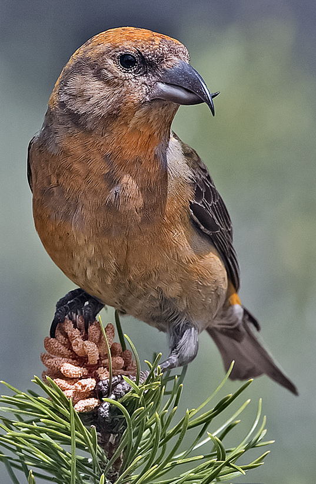

## F-test

Normally distributed data can be described by two parameters – the **mean** and the **variance**. We discussed testing the difference in the mean between two samples in the previous chapter (t-distribution and t-test). However, it is also possible to test whether *two samples which come from a population have the same variance*, i.e. the null hypothesis stating:

$$
\sigma^2_1 = \sigma^2_2
$$

as usual for population parameters, we do not know the $\sigma^2$, but they can be estimated by $s^2$ (sample variances). A comparison between sample variances is then made by **F-test**, which is a simple ratio between sample variances:

$$
F = \frac{s^2_1}{s^2_2}
$$

The $F$ statistic follows the **F-distribution** (**Fig. 1**), the shape of which is defined by **two degrees of freedom** – $DF\ numerator$ and $DF\ denominator$. These are found as $n_1 – 1$ and $n_2 – 1$ (i.e. number of observations in the corresponding sample – 1). When reporting test results in a text, both DFs must be reported (usually as subscripts). For instance, “variances in size significantly differed between green and red apples” ($F_{20,25}$ = 2.52, $p$ = 0.015).

```{r}
#| message: false
#| warning: false
#| code-fold: true
#| code-summary: "Show R Script"
#| fig-cap: "Figure 1: Probability density plot of F-distributions with different DFs."

# F(2,2)
curve(df(x, df1 = 2, df2 = 2),
      xlim = c(0, 10), col = 'red',
      main = 'Probability density of F', xlab = 'F', ylab = 'Probability density')
text(x = 0.8, y = 0.85, labels = 'F(2,2)', col = 'red')

# F(3,20)
curve(df(x, df1 = 3, df2 = 20),
      xlim = c(0, 10), col = 'green', add = T)
text(x = 1.2, y = 0.7, labels = 'F(3,20)', col = 'green')

# F(5,5)
curve(df(x, df1 = 5, df2 = 5),
      xlim = c(0, 10), col = 'blue', add = T)
text(x = 1.5, y = 0.58, labels = 'F(5,5)', col = 'blue')

# F(20,3)
curve(df(x, df1 = 20, df2 = 3),
      xlim = c(0, 10), col = 'turquoise', add = T)
text(x = 1.9, y = 0.47, labels = 'F(20,3)', col = 'turquoise')

```

## ANOVA: Analysis of variance

**F-test** is rarely used to test the differences in variances between two samples because hypotheses on variance are not common. However, **F-test** has a crucial application in the analysis of variance.

In **Chapter 7**, we discussed comparisons between the means of two samples using a **t-test**. A natural question, however, arises – what if we have more than two samples? We may try using pair-wise comparisons between each pair of them. That would, however, lead to multiple non-independent tests and result in inflated **Type I Error** probability[^1]. Therefore, we use analysis of variance (ANOVA) to solve such problems.

[^1]: This comes from the fact that if individual tests are performed at $\alpha$ = 0.05, then probability of making **Type I Error** in 2 tests (i.e. making error in at least one of the test) is p = 0.05+0.05-0.052 = 0.975.

ANOVA tests a null hypothesis on means of multiple samples, which states that the *population means are equal*, i.e.:

$$
\mu_1 = \mu_2 = \mu_3 =\ ...\ = \mu_k
$$

The mechanism of **ANOVA** is based on decomposing the total variability into two components:

1.  **systematic component** corresponding to differences *between* groups

2.  **error** (or residual) component corresponding to differences *within* groups.

These differences are measured as "squares". For each observation in the dataset:

-   **total square** (measuring difference between its *value and the overall mean*)

-   **effect square** (measuring difference between corresponding *group mean and the overall mean*[)]{.underline}

-   **error square** (measuring difference between the *value and corresponding group mean*)

can be calculated as in **Fig. 2**.

```{r}
#| message: false
#| warning: false
#| code-fold: true
#| code-summary: "Show R Script"
#| fig-cap: "Figure 2: The ANOVA mechanism: definition of 'squares' exemplified with the red data point."

set.seed(123)

# Generate data
df <- data.frame(
  group = c(rep(1, 5), rep(2, 5), rep(3, 5)),
  y = c(
    rnorm(n = 5, mean = 3, sd = 1),
    rnorm(n = 5, mean = 4, sd = 1),
    rnorm(n = 5, mean = 6, sd = 1))
)

# Plot
par(xpd = T)

plot(y ~ group, data = df, type = 'n',
     xlim = c(0.5, 3.5),
     xaxt = 'n',
     xlab = 'sample')
axis(1, at = seq(1, 3, by = 1), labels = 1:3)
polygon(x = c(2, 2, 2.95, 2.95),
        y = c(mean(df$y), max(df$y), max(df$y), mean(df$y)),
        border = NA, col = '#fcd3cc')
polygon(x = c(3.05, 3.05, 3.7, 3.7),
        y = c(mean(df$y), mean(df$y[df$group == '3']) - 0.01,
              mean(df$y[df$group == '3']) - 0.01, mean(df$y)),
        border = NA, col = '#fcd3cc')
polygon(x = c(3.05, 3.05, 3.4, 3.4),
        y = c(mean(df$y[df$group == '3']) + 0.01, max(df$y),
              max(df$y), mean(df$y[df$group == '3']) + 0.01),
        border = NA, col = '#fcd3cc')
points(y ~ group, data = df, add = T)
segments(x0 = 0.85, x1 = 1.15,
         y0 = mean(df$y[df$group == '1']),
         lwd = 2)
segments(x0 = 1.85, x1 = 2.15,
         y0 = mean(df$y[df$group == '2']),
         lwd = 2)
segments(x0 = 2.85, x1 = 3.15,
         y0 = mean(df$y[df$group == '3']),
         lwd = 2)
abline(h = mean(df$y), lty = 2)
text(x = 3.25, y = 4.2, labels = 'overall mean', cex = 0.8)
text(x = 1.35, y = 3.3, labels = 'group\nmean', cex = 0.8)
points(x = 3, y = max(df$y), bg = 'red', col = 'black', pch = 21)
arrows(x0 = 2.95, x1 = 2.95,
       y0 = mean(df$y), y1 = max(df$y),
       length = 0.1)
arrows(x0 = 2.95, x1 = 2.95,
       y0 = max(df$y), y1 = mean(df$y),
       length = 0.1)
arrows(x0 = 3.05, x1 = 3.05,
       y0 = mean(df$y), y1 = mean(df$y[df$group == '3']),
       length = 0.1)
arrows(x0 = 3.05, x1 = 3.05,
       y0 = mean(df$y[df$group == '3']), y1 = mean(df$y),
       length = 0.1)
arrows(x0 = 3.05, x1 = 3.05,
       y0 = mean(df$y[df$group == '3']), y1 = max(df$y),
       length = 0.1)
arrows(x0 = 3.05, x1 = 3.05,
       y0 = max(df$y), y1 = mean(df$y[df$group == '3']),
       length = 0.1)
text(x = 2 + (2.95 - 2) / 2,
     y = mean(df$y) + (max(df$y) - mean(df$y)) / 2,
     labels = 'Total\nSquare') 
text(x = 3.05 + (3.4 - 3.05) / 2,
     y = mean(df$y[df$group == '3']) + (max(df$y) - mean(df$y[df$group == '3'])) / 2,
     labels = 'Error\nSq.') 
text(x = 3.05 + (3.7 - 3.05) / 2,
     y = mean(df$y) + (mean(df$y[df$group == '3']) - mean(df$y)) / 2,
     labels = 'Group\n(Effect)\nSq.') 

par(xpd = F)
```

Subsequently, we can sum the square statistics over the whole dataset and get **Sums of Squares (SS)**: $SS_{total}$, $SS_{effect}$, $SS_{error}$. We can further calculate **Mean Squares (MS)** by dividing **SS** by corresponding **DF**, with:

-   $DF_{total} = n\ –\ 1$

-   $DF_{effect} = k\ –\ 1$

-   $DF_{error} = DF_{total} - DF_{effect}$

where $n$ is total number of observations and $k$ number of categories. Hence, we get:

$$MS_{effect} = \frac{SS_{effect}}{DF_{effect}}$$ $$MS_{error} = \frac{SS_{error}}{DF_{error}}$$

and now, it comes: **the mean squares are actually variances**. As a result, we can use an **F-test** to test the null hypothesis that $MS_{effect}$ is lower than or equal to $MS_{error}$[^2]. Such test is equivalent to the test of the null hypothesis stating that **all means are equal**:

[^2]: In other words, the effect of predictor is lower than the effect of random error.

$$F_{DF_{effect},\ DF_{error}} = \frac{MS_{effect}}{MS_{error}}$$

the corresponding *p-value* is then found based on a comparison with *F distribution* as in an ordinary **F-test**. Note that rejecting the null hypothesis means that *at least one of the means is significantly different from at least one other*[^3].

[^3]: Thus, based solemnly on this test, we cannot say which mean differs from which.

Besides the *p-value*, it is also possible to compute the proportion of variability explained by the groups:

$$r^2 = \frac{SS_{effect}}{SS_{total}}$$

Typical report of ANOVA result in the text then reads:

> Means were significantly different among the groups ($r^2$ = 0.70, $F_{2,\ 12}$ = 14.63, $p$ = 0.0006).

## ANOVA assumptions

ANOVA application assumes that:

1.  samples come from normally distributed populations

2.  variances are equal among the groups

These assumptions can be checked by analysis of residuals as they can be restated as requirements for:

1.  normal distribution of residuals

2.  the constant variance of residuals

There are formal tests testing for normality, such as the Shapiro-Wilk test, but their use is problematic as they test the null hypothesis that a given sample comes from a normal distribution. The tests are **more powerful** (likely to reject the null) if there are **many observations**. But in that case, **ANOVA is rather robust** to moderate violations of the assumption.

By contrast, formal tests of normality fail to identify the most problematic cases, when the assumptions are not met, and also the number of observations is low because in such cases, their power is low.

Instead, I highly recommend a visual check of the residuals. In particular, a scatterplot of standardized residuals and normal quantile-quantile (QQ) plots are informative about possible problems with ANOVA assumptions. Details on how to use these plots to assess ANOVA assumptions are very nicely explained [here](https://arc.lib.montana.edu/book/statistics-with-r-textbook/item/57).

## Post-hoc comparisons

When we get a significant result in ANOVA (and ONLY in such case!), we may be further interested to see *which mean is different from which*. The statistical theory does not provide much help here, however, some pragmatic tools were developed for this purpose.

These are based on the principle of **pair-wise comparisons** (similar to a series of pair-wise two-sample t-tests), which control the inflation of the **Type I Error** probability by adjusting the *p-values* upwards. An example of such a test is the **Tukey Honest Significant Difference Test** (Tukey HSD).

Results of ANOVAs and the post-hoc tests can be summarized in plots with letter indices where different letters indicate significant differences between groups (**Fig. 3**). You can plot either fitted values with confidence intervals of the fit (**Fig. 3** left) – this corresponds exactly to the fitted ANOVA model or a boxplot (**Fig. 3** right) which displays the distribution of the data but does not display the means (which are subject to testing by ANOVA).

```{r}
#| message: false
#| warning: false
#| code-fold: true
#| code-summary: "Show R Script"
#| fig-cap: "Figure 3: Displaying ANOVA results. Dotchart displaying means and 95%-confidence intervals for the means of the three samples (left). Box-plot displaying the observed values of the response variable (y) for individual levels of the categorical predictor. Means significantly different from each other at α = 0.05 are denoted by different letters (based on the Tukey HSD test)."

par(mfrow = c(1,2))

# ANOVA
summary(aov(y ~ as.factor(group), data = df))

### Post-hoc test
TukeyHSD(aov(y ~ as.factor(group), data = df))

### LM (create model)
m1 <- lm(y ~ as.factor(group), data = df)

### Predicted values (exxtracted from the model)
pred <- cbind(predict(m1, interval = 'confidence', level = 0.95), group = df$group)

pred2 <- data.frame(pred[c(1,6,11),])

# LEFT PLOT
### Dotchart
plot(y = pred2$fit, x = pred2$group, ylim = c(2,8), xlim = c(0.5, 3.5), type = 'n', xaxt = 'n', yaxt = 'n', xlab = 'sample', ylab = 'Fitted value')
axis(2, at = seq(2, 8, by = 2))
axis(1, at = seq(1,3, by = 1))
points(x = pred2$group, y = pred2$fit, pch = 16)
segments(x0 = c(1,2,3), x1 = c(1,2,3),
         y0 = pred2$lwr, y1 = pred2$upr)
text(x = c(1,2,3), y = c(4.4, 5.2, 7.6), labels = c('a', 'a', 'b'))


# RIGHT PLOT
### Boxplot
boxplot(y ~ as.factor(group), data = df, ylim = c(2,8), ylab = 'Observed value', xlab = 'sample', yaxt = 'n')
axis(2, at = seq(2, 8, by = 2))
text(x = c(1,2,3), y = c(5.1, 6.2, 7.8), labels = c('a', 'a', 'b'))

par(mfrow = c(1,1))
```

::: callout-note
## How to do in R

#### F-test, F-distribution

-   `var.test()` - F Test to Compare Two Variances

-   `pf()`, `qf()` - F distribution probabilities

#### ANOVA

-   `aov()` - fit an analysis of variance model, accepts formula syntax. Note, that the predictor must be a factor, otherwise linear regression is fitted (which is not correct, but no warning is given)

-   `summary(aov.object)` - displays the ANOVA table with $SS$, $MS$, $F$ and $p$

-   `plot(aov.object)` - displays diagnostic plots for checking ANOVA assumptions. See [this page](https://arc.lib.montana.edu/book/statistics-with-r-textbook/item/57) for a detailed explanation. Note, that this webpage refers to more general regression diagnostics, which we will discuss in upcoming classes. It is, however, basically the same principle except for the diagnostics plot #4, which you may ignore for now.

#### Post-hoc test

-   `TukeyHSD(aov.object)` - Produces a table with differences between groups. Post-hoc letters as in **Fig. 3** can be produced in R, but the implementation is not straighforward (see practicals script for details). However, there is always an option to add them manually.
:::

## Excercises

1.  The temperature of water in one pot was measured by different thermometers manufactured by two companies: Termom and Celsimet. Each of them provided ten thermometers for the testing. The aim of the testing was to detect potential systematic bias (whether the thermometers of one company show, on average, different values from those made by the other) and whether there is a difference in accuracy. The data were as follows:

    Termom: 18, 19, 18, 17, 16, 19, 18, 17, 19, 18

    Celsimet: 17, 15, 21, 20, 19, 22, 15, 16 ,18, 17

    Test both differences in mean values and the accuracy between the two manufacturers. Would you buy a thermometer produced by any of these companies? Voluntary task: go to a homeware shop, check thermometers there, and let the class know if the temperature pattern is similar to Termom, Celsimet, or different from both.

2.  In a fertiliser application experiment, plants growing in pots (one plant/one pot) were fertilised with different kinds of fertiliser. Dry weight of above-ground biomass was determined for each pot at the end of the experiment. The resulting masses are shown in **Table 1**:

    | Type of fertiliser | DWb \[g\] | DWb \[g\] | DWb \[g\] | DWb \[g\] | DWb \[g\] | DWb \[g\] |
    |----|----|----|----|----|----|----|
    | Water (control) | 87 | 95 | 74 | 85 | 89 | 97 |
    | Mineral NPK diluted in water | 140 | 180 | 155 | 164 | 157 | 149 |
    | Mineral solid slowly decomposing NPK | 150 | 190 | 165 | 185 | 171 | 182 |
    | Ammonnium nitrate | 123 | 145 | 136 | 134 | 141 | 131 |
    | Organic manure | 145 | 161 | 175 | 149 | 141 | 169 |

    : Table 1. Dry weight above-ground biomass from pot experiment. DWb = dry weight biomass.

    Does the application of different types of fertiliser affect plant biomass? If yes, how?

3.  20 experimental rats were given four types of nutrition. The effect of these types of nutrition on rat intelligence was measured by the time the rats needed to find a way out of a labyrinth.

    | Nutrition                | s   | s   | s   | s   | s   |
    |--------------------------|-----|-----|-----|-----|-----|
    | Control nutrition        | 56  | 75  | 65  | 85  | 74  |
    | Fat enriched             | 102 | 108 | 95  | 84  | 115 |
    | Sugar enriched           | 85  | 92  | 75  | 69  | 79  |
    | Control nutrition + beer | 45  | 56  | 53  | 61  | 57  |

    : Table 2. Time in seconds \[c\] which took each rat group to find a way out of a labyrinth.

    Does nutrition have an effect on rat intelligence? How do individual nutrition types affect rat intelligence?

**#AI** Ask your favourite LLM to solve task 3, including the graph with Tukey comparison letter display, and generate the corresponding R script.

#### Tasks for independent work

A.  Distribution of four bird species on the gradient of altitude was studied in Moravia by recording the altitudes of their nests. The resulting data were as follows (**Table 2**):

    +--------------------------------------------------+---------------+---------------+---------------+---------------+---------------+---------------+
    | Species                                          | Nest altitude | Nest altitude | Nest altitude | Nest altitude | Nest altitude | Nest altitude |
    +==================================================+===============+===============+===============+===============+===============+===============+
    | sea eagle                                        | 160           | 180           | 224           | 175           | 305           | 280           |
    |                                                  |               |               |               |               |               |               |
    | {width="166"} |               |               |               |               |               |               |
    +--------------------------------------------------+---------------+---------------+---------------+---------------+---------------+---------------+
    | blackbird                                        | 780           | 540           | 180           | 380           | 685           | 430           |
    |                                                  |               |               |               |               |               |               |
    |              |               |               |               |               |               |               |
    +--------------------------------------------------+---------------+---------------+---------------+---------------+---------------+---------------+
    | raven                                            | 1200          | 830           | 450           | 1050          | 870           | 930           |
    |                                                  |               |               |               |               |               |               |
    |              |               |               |               |               |               |               |
    +--------------------------------------------------+---------------+---------------+---------------+---------------+---------------+---------------+
    | red crossbill                                    | 780           | 830           | 680           | 1005          | 970           | 950           |
    |                                                  |               |               |               |               |               |               |
    |              |               |               |               |               |               |               |
    +--------------------------------------------------+---------------+---------------+---------------+---------------+---------------+---------------+

    : Table 2. Nest altitudes (in m a.s.l.) of different bird species

    Does the mean of the altitudinal range significantly differ between the species?

B.  The number of insect herbivore species was recorded on three species of trees in a forest (9 randomly chosen individuals per species). The following numbers of herbivore species were recorded (**Table 3**):

    | Species | \# sp. | \# sp. | \# sp. | \# sp. | \# sp. | \# sp. | \# sp. | \# sp. | \# sp. |
    |---------|--------|--------|--------|--------|--------|--------|--------|--------|--------|
    | beech   | 3      | 5      | 4      | 3      | 7      | 8      | 4      | 6      | 5      |
    | spruce  | 8      | 3      | 6      | 7      | 3      | 4      | 6      | 5      | 5      |
    | lime    | 10     | 7      | 15     | 12     | 9      | 8      | 12     | 11     | 7      |

    : Table 3. Herbivore richness on different tree species.

    Do the tree species differ in the species richness of herbivore communities? If yes, how?

C.  Wheat (*Triticum aestivum*) was cultivated in pots with three substrates: sandy, clay, and peaty. Chlorophyll concentration \[$\mu mol$ per $cm^2$ of leaf area\] was then analysed in the leaves of the experimental wheat plants. The results are summarised below (**Table 4**):

    | Substrate | $\mu mol / cm^2$ | $\mu mol / cm^2$ | $\mu mol / cm^2$ | $\mu mol / cm^2$ | $\mu mol / cm^2$ | $\mu mol / cm^2$ |
    |----|----|----|----|----|----|----|
    | sandy soil | 50 | 45 | 61 | 54 | 48 | 42 |
    | clay | 53 | 61 | 59 | 49 | 58 | 69 |
    | peaty soil | 31 | 40 | 41 | 28 | 35 | 37 |

    : Table 4. Chlorophyll concentration in leaves on different substrates.

    Does the soil type have a significant effect on chlorophyll concentration?

D.  Speed of cars was measured by the traffic police on the Nové Sady Street in Brno. The drivers exceeding the speed limit of 50 $km/h$ were punished by a fine. In addition to the speed, the car color was recorded. The resulting speed data (in $km/h$) were the following (**Table 5**):

    | Car colour | speed ($km/h$)                                 |
    |------------|------------------------------------------------|
    | red        | 50, 52, 47, 43, 40, 49, 49, 75, 48, 50, 48, 49 |
    | blue       | 65, 50, 47, 75, 45, 38, 67, 57, 54             |
    | black      | 45, 76, 58, 53, 54, 50, 48, 49                 |
    | yellow     | 38, 49, 54, 49                                 |

    : Table 5. Car speed by carolour.

    Is the driving speed associated with car color? Should the police focus more on drivers driving cars of a particular color?
