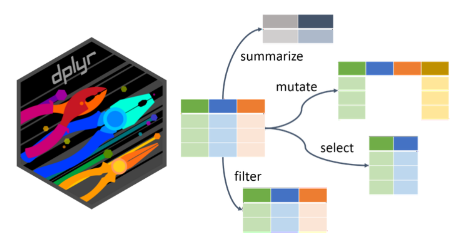

In this chapter, we will explore the data, prepare subsets with selected
variables and filter them to a few defined cases. We will prepare new
variables and rearrange the data according to them. We will further
train on importing and exporting the data.

Again, we will use the data from the training project that you
downloaded in Chapter 1. Before you start, I recommend creating **a new
script** for this chapter and **clearing objects from the workspace**
(use the broom icon to clean your working environment).

## 2.1. Introducing `dplyr`

The term data manipulation might sound a bit tricky. However, it does
not mean we plan to show you how to cheat and get better results. It
simply means we want to show you how to easily handle the data and
prepare it in the form you need. The functions for basic data handling,
namely **`select()`, `filter()`, `mutate()`, `arrange()`**, and
**`slice()`**, are provided by the tidyverse package `dplyr`. Do you
remember how to find out more about the package? If nothing else, you
can try `?dplyr`, which actually gives you more hints on where to look
further.

{fig-align="center" width="755"}

Note that many of these operations can also be performed in some table
editors (e.g., Excel) before importing to R. However, the effort and
time demands would be significantly higher and would increase enormously
with the size of the dataset. In contrast, in R, you can modify and
rerun the steps in a single pipeline, and the data will be immediately
ready for the following analysis.

We will need the following libraries:

```{r}
#| warning: false
library(tidyverse)
library(readxl)
library(janitor)
```

And the forest understory dataset. Again, we will import the data just
once and use the pipe to test the

functions/effects without actually changing the data:

```{r}
data <- read_csv("data/forest_understory/Axmanova-Forest-understory-diversity-analyses.csv")
names(data)
```

## 2.2 `select()`

`select()` **extracts columns/variables** based on their names or
position. It is essential to understand the distinction between
`select()` and `filter()`. `select()` is used to select variables
(columns) we want to keep in the dataset, while `filter()` applies to
rows depending on their values.

You can select variables by name. Here, you would appreciate the tidy
style of names! Tidy names mean no need to use parentheses :-).

```{r}
data %>% 
  select(PlotID, ForestType, ForestTypeName) 
```

You can also select by position. However, if you make any changes to the
data, it might not work as you need.

```{r}
data %>% 
  select(1:3)
```

Sometimes, you decide you want to get rid of some variables. Either name
all the others that you want to keep, or remove the unwanted ones with a
minus sign. In the case of just one variable, it is easy: `select(-xx)`.
If you want to exclude two or more, you have to use
`select(-c(xx, xy))`.

```{r}
data %>% 
  select(-c(ForestType, ForestTypeName))
```

You can also define a range of variables between two of them.

```{r}
data %>%
  select(PlotID:ForestTypeName)
```

Or you can combine the approaches listed above:

```{r}
data %>%
  select (PlotID, 3:6)
```

`select()` can also be used in combination with functions from the
`stringr` package to identify a specific pattern in the names. Try
several options: `starts_with()`, `ends_with()` or a more general one,
`contains()`.

```{r}
data %>%
  select (PlotID, starts_with("EIV"))
```

`select()` can effectively help you organise the data. Imagine you have
a workflow where you need only some variables, but in a specific
sequence. And you import the data from different people or years. By
using `select()` in your script, you can always order the variables in
the same way, e.g., SampleID, ForestType, SpeciesNr, Productivity, even
during import. You can also rename the variables using select to get
exactly what you need. Here, the new name is on the left, as in
`rename()`.

```{r}
data %>% 
  select(SampleID = PlotID, ForestCode = ForestType, SpeciesNr = Herbs, Productivity = Biomass) 
```

## 2.3 `arrange()`

This function retains the same variables and **reorders the rows**
according to the values of the selected variables. To view the changes
at a glance, we will first select only a few variables in the dataset.

```{r}
data <- read_csv("data/forest_understory/Axmanova-Forest-understory-diversity-analyses.csv") %>% 
  select(PlotID, ForestType, ForestTypeName, Biomass,pH_KCl)
```

Now we have decided to arrange the data by Forest type.

```{r}
data %>% 
  arrange(ForestTypeName)
```

We can also decide to arrange the data from the highest value to the
lowest, i.e. in descending order.

```{r}
data %>% 
  arrange(desc(Biomass))
```

Or we can arrange according to more variables. Here, the forest type is
listed first, as we have decided it is the most important grouping
variable. Within each type, we want to see the rows/cases ordered by
biomass values.

```{r}
data %>% 
  arrange(ForestType, ForestTypeName, desc(Biomass)) %>% 
  print(n = 30)
```

To see more rows of the resulting table, we specified their number using
the `print()` function.

## 2.4 `distinct()`

`distinct()` is a function that **removes all the duplicate rows**,
keeping only the unique ones. There are many cases where you will truly
appreciate this elegant and effortless approach. For example, we want a
list of unique Plot IDs, unique combinations of two categories, and so
on. Here, we aim to compile a list of forest type codes and
corresponding names.

```{r}
data %>%
  arrange(ForestType) %>%
  select(ForestType, ForestTypeName) %>%
  distinct()
```

The same can also be done if I skip the select tool, because
`distinct()` works more like `select()` + `distinct()`.

```{r}
data %>%      
  arrange(ForestType) %>%
  distinct(ForestType, ForestTypeName)
```

Sometimes, `distinct()` can also be used when importing data to remove
duplicate rows that were overlooked previously:
`data <- read_csv... %>% distinct()`.

## 2.5 `filter()` and `slice()`

When we have a large dataset, we sometimes need to **create a subset**
of the rows/cases. First, we need to define the variable on which we
will filter the rows (e.g., Forest type, soil pH) and determine which
values are acceptable and which are not.

In this first example, we use a categorical variable, and we want to
match the **exact value**, so we have to use the **EQUAL operator**
`==`.

```{r}
data %>% 
  filter(ForestTypeName == "alluvial forest")
```

Or we might define a **list of values**, especially for categorical
variables. The filter function will try to find rows with values exactly
matching those `%in%` the list.

```{r}
data %>% 
  filter(ForestTypeName %in% c("alluvial forest", "ravine forest"))
```

When filtering a continuous variable, we can work with **thresholds**.
For example, here the biomass of the herb layer is measured in g/m^2^,
and we want only those rows/cases where the biomass values are higher
than 80.

```{r}
data %>% 
  filter(Biomass > 80) #[g/m2]
```

You can also filter plots within a specified range and apply **multiple
conditions**. Here, we select all plots of the specified types and use a
further condition to include only those with biomass above the specified
level.

All of the conditions need to be valid for the case to be included in
the selection, because we included the **AND operator** `&`.

```{r}
data %>% 
  filter((ForestTypeName %in% c("alluvial forest", "ravine forest") &
    (Biomass >= 80))) %>% 
      arrange(desc(Biomass))

```

Here we use the same approach, but specify conditions for three
variables at once.

```{r}
data %>%  filter(ForestTypeName =="oak forest" & pH_KCl >=4 & Biomass>20)
```

We can also use the **operator OR** (`|`) between the two conditions.
This means that we will include the case where either one or the other
condition is met. For example, either high herb-layer biomass or high
pH, which are two different ways to estimate a relatively productive
forest site.

```{r}
data %>% filter(Biomass>90 | pH_KCl>6)
```

We can **combine AND and OR** also in one filter step. For example, we
want to keep only plots with biomass in the range of 40–80 g/m², but we
also want to keep plots without any value (NA).

```{r}
data %>%    
  filter((Biomass >= 40 & Biomass <= 80) | is.na(Biomass)) 
```

Sometimes you might find it useful to **filter something out**, rather
than specifying what should stay. This is indicated by the exclamation
mark, as shown below.

```{r}
data <- read_csv("data/forest_understory/Axmanova-Forest-understory-diversity-analyses.csv") 
data %>% 
  filter(!is.na(Juveniles))
```

A specific alternative to `filter()` is the **`slice()`** function.
Let's say I want to get the top 3 rows/cases/vegetation samples with the
highest numbers of recorded juveniles. So, we can arrange the values,
determine the threshold and filter the values above it. Or we can use
`slice_max()` to do the job for us.

```{r}
data %>% 
  filter(!is.na(Juveniles)) %>%
  slice_max(Juveniles, n = 3) 
```

Tip: Try `slice_min()` if you need the lowest values.

Default settings of slice may return more rows than you requested in
case there are ties on the given position. Check ?slice_max.

## 2.6 `mutate()`

`mutate()` adds **new variables that are functions of existing
variables,** or it can be used to overwrite original variables according
to your specification. Note that in the examples below, select is used
only to make the results visible at first sight.

We can use mutate to create **new variables based on mathematical
operations** (e.g. percentage, summed, rounded). For example, in the
field, I recorded juveniles of woody plants and all other herb-layer
species separately. However, we now want to sum these two values for
each row/case/vegetation plot so that we can speak about overall species
richness. I create a new variable by simply summing these two (note how
easy it is with tidy names!).

```{r}
data %>% 
  mutate(SpeciesRichness = Herbs + Juveniles) %>%
  select(PlotID, SpeciesRichness, Herbs, Juveniles)
```

Sometimes, you want to **add a variable where all rows/cases will
receive the same value**. For example, because you plan to join the data
with other data and you want to keep information about the sources or
because it is useful for another `mutate()` step. This is also a
straightforward method for converting data with abundances to
presence/absence data. Here we create a variable selection which

```{r}
data %>% 
  mutate(selection = 1)%>%
  select(PlotID, selection, ForestType, ForestTypeName)
```

You can also create a variable with more categories based on the values
of other variables using **`ifelse()`** inside **`mutate()`**. You give
the condition for when it should be called 'low' and what to do if the
condition is not met - name it 'high'.

```{r}
data %>%
  mutate(Productivity = ifelse(Biomass<=60,"low","high")) %>% 
  select (PlotID, ForestTypeName, Productivity, Biomass) %>%
  print(n=20)
```

The same can be done with a similar approach using **`case_when()`.**
Conditions are evaluated from the first (on the left) to the last (on
the right side), so for each step, you take only the rows that are not
yet treated by the previous condition.

```{r}
data %>% 
  mutate(Productivity = case_when(
    Biomass <= 60 ~ "low", 
    Biomass > 60 ~ "high")) %>% 
  select(PlotID, ForestTypeName, Productivity, Biomass) %>%
  print(n = 20)
```

**Tip:** Inside ‘Condition’, you can also use other conditional
operators, like AND (`&`), OR (`|`), or EQUAL (`==`).

We can set conditions to define one category and then specify what
should happen with the rest (cases not fulfilling the above conditions).
For example, here I define the conditions for the selection category
"yes", and the rest will be "no" without any need for other definitions
of this second group; this is done by using the argument TRUE \~ .

```{r}
data %>% mutate(Selection = case_when(
  Biomass>80 & ForestTypeName =="aluvial forest" ~ "yes",
  TRUE ~"no"))
```

We often use `mutate()` to **transform original values** directly. This
is also useful for fixing some issues that we do not want to or cannot
change in the original source data. In the example below, I will just
change the names of the categories. Check with view () if the other
categories correspond to the original ones.

```{r}
data %>% distinct(ForestTypeName)

data %>% 
  select(PlotID, ForestTypeName,Biomass) %>% 
  arrange(ForestTypeName) %>% 
  mutate(ForestTypeName_corrected = case_when(
  ForestTypeName=="alluvial forest" ~ "alder forest",
  TRUE ~ ForestTypeName))
```

Now you can use the same lines, but use mutate directly to change the
ForestTypeName.

```{r}
data %>% 
  select(PlotID, ForestTypeName,Biomass) %>% 
  arrange(ForestTypeName) %>% 
  mutate(ForestTypeName = case_when(
  ForestTypeName=="alluvial forest" ~ "alder forest",
  TRUE ~ ForestTypeName))
```

One of the examples is to change the type of the variable, e.g. from
numeric to character. To work with multiple variables at once, e.g.,
round them, we can use **`mutate(across())`** and specify the function.
**`.x`** refers to the entire column (vector) being transformed inside a
function like `mutate(across(...))` or `map()`.

```{r}
data %>% 
  mutate(across(c(Biomass, pH_KCl), ~ round(.x, digits = 1))) %>%
  select(PlotID, Biomass, pH_KCl)
```

Or you can even list all the functions you want to apply at once.

```{r}
data %>% 
  select(PlotID, Biomass, pH_KCl) %>% 
  mutate(across(
    c(Biomass, pH_KCl),
    list(round = ~ round(.x, 1),
         log = log,
         sqrt = sqrt)))
```

## 2.7 Save the data

If you decide that you have already prepared the dataset in the form it
should be used later, you probably need to save it and export, e.g. as a
csv. Remember that we were primarily trying to see what it would look
like with the `%>%`, so you must either assign the dataset to a new
object or add the write command at the end of the pipeline. See also
Chapter 1.

Here we will play a bit with the `tidyverse` package `readr`. You can
find out more in the readr cheatsheet. In the examples below, you are
saving the data in the folder "chapter2", which you need to create
first. Try to create it directly in the R studio through the Files.

Write a comma-delimited file:

```{r}
#| eval: false
write_csv(data, "results/chapter2/forest_selected1.csv") 
```

Note that you can save the data directly from the pipeline - just add it
as another step and skip the "data" argument:

```{r}
#| eval: false
data %>% 
  select(PlotID, Biomass, pH_KCl) %>% 
  mutate(across(
    c(Biomass, pH_KCl),
    list(round = ~ round(.x, 1),
         log = log,
         sqrt = sqrt))) %>% 
  write_csv("results/chapter2/forest_selected1.csv") 
```

Write a semicolon-delimited file (;):

```{r}
#| eval: false
write_csv2(data, "results/chapter2/forest_selected2.csv")
```

Write excel_csv file, which can help you easily open the file in Excel
and will keep the encoding you need.

```{r}
#| eval: false
write_excel_csv(data, "results/chapter2/forest_selected3.csv")
```

Note that, in contrast to the `write.csv()` function, the `write_csv()`
function adheres to the tidyverse philosophy, so row names are not
included in the export.

\*You can also write directly to an Excel file, for example, using the
`writexl` library.

```{r}
#| eval: false
library(writexl)
write_xlsx(data, 'results/chapter2/forestEnv.xlsx')
```

To create an xlsx with (multiple) named sheets, you would need to
provide a list of data frames. Here, we specify that data1 should be
saved as an Excel sheet named forestEnv (environmental data) and data2
as a sheet named forestSpe (species data from the same dataset).

```{r}
#| eval: false
library(writexl)

data1 <- read_excel("data/forest_understory/Axmanova-Forest-understory-diversity-analyses.xlsx")
data2 <- read_excel("data/forest_understory/Axmanova-Forest-spe.xlsx")


write_xlsx(list(forestEnv = data1, 
                forestSpe = data2), 
           'results/chapter2/forest.xlsx' )
```

## 2.8 Exercises

We will mostly use the data from the example project described in the
first chapter ([section to-do
first](https://botzooldataanalysis.github.io/DataManipulationVisualisation/1_introduction.html)),
or data integrated in the R software packages or data available online.

Tip: If you copy the task descriptions and add them directly to your
script, it is simply too long, right? Do you know how to read long lines
of text in an R script? Go to "Code" and tick "soft wrap long lines".

1\. **Forest Data** - data in your project folder. This dataset is used
throughout the whole chapter above. Please use it to prepare your own
script with remarks, copy and train what is described above.

2\. Directly from RStudio, create a folder `results/chapter2` for saving
today's datasets, as we will train a bit of exporting of the data.

3\. Use the Forest Data to train more. Import it once again with the
clean_names function. -\> Rename the soil pH variable to soil_ph and
biomass to productivity. -\> Create variable "author" which will contain
the name Axmanova. -\> Create variable "richness" by summing the herbs
and juveniles. -\> Select variables plot_id, author, richness,
productivity and soil_ph. -\> Save this dataset as a csv file into
`results/chapter2`.

4\. Use the Forest dataset again. Find five plots with the lowest
biomass from forest types other than oak forests.

5\. Select PlotID and all variables that are connected to transmitted
light (Trans..) \> round these variables.

6\. Using `case_when()` define a new variable called productivity, with
three categories: low, medium, and high, with thresholds of x\<=60,
60-90, \>=90. How many rows/cases are in the category medium?

7\. **iris dataset:** We will use the famous `iris dataset` of flower
measurements. Find out more details by asking R `?iris` as the dataset
is integrated in R and ready to use. \>\> Upload the iris dataset into
an object using the assignment like this: `data <- iris`. \>\> Check the
structure of the dataset. Is it stored as a tibble or a data frame? If
the latter, you might need to change the format to a tibble first using
`data%>% as_tibble()`.\>\> Now select variables including taxon name and
those of length measurements.\>\> Arrange the data according to
Sepal.Length \>\> Filter 15 rows with the longest sepals. Which species
prevails among these top 15? \>\> \*How many rows/cases did you actually
get, and do you know why?

8\*. **squirrel data:** Load data of squirrel observations from the
[Central Park Squirrel
Census](https://github.com/rfordatascience/tidytuesday/blob/main/data/2023/2023-05-23/readme.md)
using this line:
read_csv('https://raw.githubusercontent.com/rfordatascience/tidytuesday/main/data/2023/2023-05-23/squirrel_data.csv')
\>\> Check the structure, rename variables to get tidy names \>\>find
out what are the possible colours of fur \>\> select at least 5
variables, including ID, fur colour, location, ... \>\> Filter squirrels
of one fur colour, up to your preference \>\> Arrange data by location.
\>\> Print at least 30 rows

9\*. **example4** from **messy data folder** - Load the data and check
the structure of the dataset \>\> How many rows are there? \>\> Import
the data again and now add the distinct () as a next step in the
pipeline \>\> Check what happened.

## 2.9 Further reading

`dplyr` main web page: <https://dplyr.tidyverse.org>

Find `dplyr` and `readr` Cheatsheet in Posit:
<https://posit.co/resources/cheatsheets/>

Chapter devoted to Data transformation in the R for Data Science book:
<https://r4ds.hadley.nz/data-transform.html>

encoding issues during import and export:
<https://irene.rbind.io/post/encoding-in-r/>
