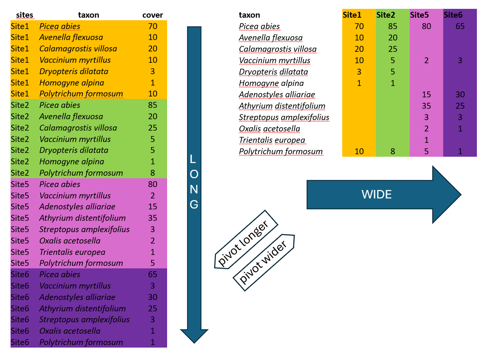
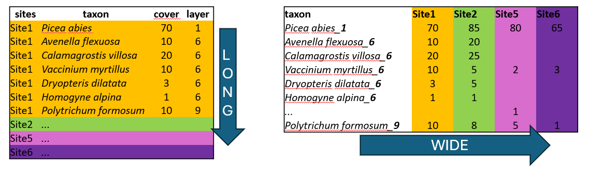
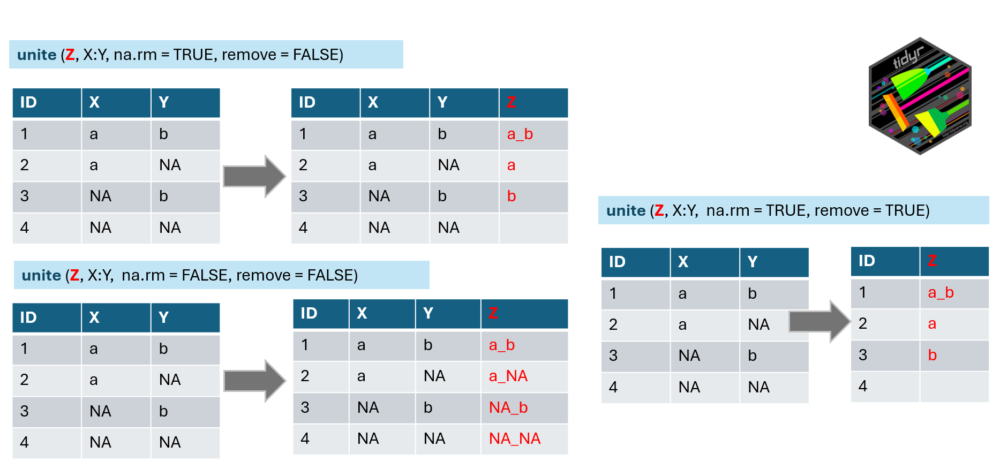

In this chapter, we will examine various data formats and learn how to convert between them. We will define groups within the data and calculate several statistics for them using summarise functions.

<!--add mutate ifelse with other symbols  -->

<!--unite and separate with different separator  -->

## 4.1 Data formats

There are two main ways in which the data can be organised across rows and columns—wide or long format. We will show you an example of spruce forest data, where we recorded plant species in several sites and, at each site, we also estimated their abundance, here approximated as percentage cover (a higher value means that the species covered a larger area of the surveyed vegetation plot, but we do not give the area itself, but relatively to the total area, i.e. percentage of the total area). Note that the cover of species might overlap, as they grow at different heights.



**Wide format** is more conservative and used in many older packages for ecological data analysis. In our example, we list all species, and the columns correspond to individual sites/samples, and the values indicate species abundance at each site. This type of data is often called a species matrix, and you would need this arrangement e.g. for ordinations in `vegan`. However, the wide format also has many cons.

One of them is the file size. In the example above, there is an abundance of given plants in each of the sites. When a species is present at only one site, such as *Trientalis europaea*, it still occupies space across the entire table, where there can be hundreds or thousands of sites. The table code, of course, is memory-demanding.

One more point. For many ecological analyses, you cannot keep the empty cells empty, since they are recognised as NAs. Therefore, you must take an additional step and fill them with zeros.

Another disadvantage is that it is not easy to add new information to the listed species. For example, if you want to separate species that are in a tree vegetation layer (recognised in vegetation ecology as 1), a herb layer (6), and a moss layer (9), you would have to add this information to the species name, e.g., *Picea_abies_1*. Can you see a conflict with the basic principles of tidyverse?



**Long format,** in contrast, is excellent for handling large datasets. Imagine we have more sites than those shown in the example above. In this format, we list all the species for Site1, then for Site2, and so on. However, we list only the species that are actually present! By simply counting the rows belonging to each site, you have the information about the overall species richness.

We can also add any information that describes the data, such as vegetation layers, growth forms, native/alien status, etc. After that, we can very simply filter, summarise and calculate further statistics.

## 4.2 From long to wide

We will first start a new script for this chapter and load the libraries. Remember to keep the script tidy and include your remarks.

```{r}
#| warning: false
library(tidyverse)
library(readxl)
library(janitor)
```

Now, we will import the data. In the first example, we will again use the `Forest understory data` from our folder. However, this time we will upload the species data saved in a long format, and we will prepare a species matrix in a wide format, so that it can be used in specific ecological analyses, e.g. in `vegan`.

```{r}
spe <- read_csv("data/forest_understory/Axmanova-Forest-spe.csv")
tibble(spe)
```

We can see that there are plant species names sorted by RELEVE_NR, where each number indicates a vegetation record from a specific site (also known as a vegetation plot or sample). We will rename this to make it easier for us as PlotID. Furthermore, we may need to modify the species names to conform to the compact format, using underscores instead of spaces. For this, we will use the **`mutate()`** function with **`str_replace()`** (for string replacement), specifying that an underscore should replace each space, and apply it directly to the original column.

```{r}
spe %>% 
  rename(PlotID = RELEVE_NR) %>%
  mutate(Species = str_replace_all(Species, " ", "_"))
```

\*If you want to play a bit, you can create a new column (e.g. SpeciesNew) to see both the original name and the changed name and test also other types of separators.

```{r}
spe %>%
  rename(PlotID = RELEVE_NR) %>%
  mutate(SpeciesNew = str_replace_all(Species, " ", "_"))
```

Note that, just as above, you can change different patterns, e.g., remove part of the strings. There are even more complex things we can do, but we will save them for later, as they require some knowledge of regular expression rules. Here, I created a new column where I removed the indication that the species belongs to a complex, i.e., the part of the string saying it is an aggregate. I also prepared a column "check" where I compare the new and old names to determine if they are equal or not, and filtered only those cases where they are not. This should show me exactly the changed rows. If I am satisfied with the result, I can then remove the lines using this check and even rewrite the original column.

```{r}
spe %>% 
  rename(PlotID = RELEVE_NR) %>%
  mutate(SpeciesNew = str_replace_all(Species, " agg.", "")) %>%
  mutate(check = (SpeciesNew == Species))%>% 
  filter(check == "FALSE") %>%
  select(PlotID, Species, SpeciesNew, check) #select only relevant to see at a first glance
```

We have the condensed name with underscores, but there are still more variables in the table. We can either remove them or merge them to be included in the final wide format. Here, we will deviate slightly from tidy rules and add the information about the vegetation layer directly to the variable Species using the **`unite()`** function from the `tidyr` package, which merges strings from two or more columns into a new one: **A+B =** **A_B**. Default separator is again underscore, unless you specify it differently by the `sep` argument e.g. `sep= "."`



Argument `na.rm` indicates what to do if in one of the combined columns there is no value but NA. We have set this argument to TRUE to remove the NA. If you keep it FALSE, it is possible that in some data, the new string will be a_NA or NA_b, or even NA_NA (see line 4 of our example).

The `remove` argument set to TRUE will remove the original columns that we used to combine the new one (in the example above, you will have only z). In our case, we will keep the original columns for visual checking, and we will use the `select()` function in the next step to remove them.

```{r}
spe %>% 
  rename(PlotID = RELEVE_NR) %>%
  mutate(Species = str_replace_all(Species, " ", "_")) %>%
  unite("SpeciesLayer", Species, Layer, na.rm = TRUE, remove = FALSE) 
```

Note that the function that works in the opposite direction is called `separate()` or, more recently, it is recommended to use `separate_wider_delim()`. To make it easier to later separate the information about layer, we can decide to use one separator within the species-name string (e.g. ".") and another separator to attach the layer information (here I specify it in the sep argument, but the default would be the same).

```{r}
spe %>% 
  rename(PlotID = RELEVE_NR) %>%
  mutate(Species = str_replace_all(Species, " ", ".")) %>%
  unite("SpeciesLayer", Species, Layer, sep= "_", na.rm = TRUE, remove = FALSE) 
```

At this point, we have everything we need to use it as input for the wide-format table: PlotID, SpeciesLayer, and the values of abundance saved as CoverPerc. One more step is to select only these or deselect (-) those that are not needed.

```{r}
spe %>% 
  rename(PlotID = RELEVE_NR) %>%
  mutate(Species = str_replace_all(Species, " ", ".")) %>%
  unite("SpeciesLayer", Species, Layer, na.rm = TRUE, remove = FALSE) %>%
  select(PlotID, Species, Layer)
```

Now we can finally use the **`pivot_wider()`** function to transform the data. We need to specify where we are obtaining the names of new variables (**`names_from`**) and where we should get the values that should appear in the table (**`values_from`**).

```{r}
spe %>% 
  rename(PlotID = RELEVE_NR) %>%
  mutate(Species = str_replace_all(Species, " ", ".")) %>%
  unite("SpeciesLayer", Species, Layer, na.rm = TRUE, remove = TRUE) %>%
  pivot_wider(names_from = SpeciesLayer, values_from = CoverPerc)
```

There are different combinations of species in each plot, with some species present and others absent. Since we changed the format, all species, even those not occurring at that particular site or plot, must have some values. In long format, abundance or other information is not stored for absent species, so they are assigned NAs. Therefore, one additional step is to fill the empty cells with zeros using **values_fill**. In this case, we can do that because we know that if the species were absent, its abundance was exactly 0. I will assign the results to a new object called spe_wide.

```{r}
spe %>% 
  rename(PlotID = RELEVE_NR) %>%
  mutate(Species = str_replace_all(Species, " ", ".")) %>%
  unite("SpeciesLayer", Species, Layer, na.rm = TRUE, remove = TRUE) %>%
  pivot_wider(names_from = SpeciesLayer, values_from = CoverPerc,
              values_fill = 0) -> spe_wide
```

## 4.3 From wide to long

Sometimes, it is necessary to transform data **from wide to long** format. Here, we need to say which column should not be changed, which is the PlotID (**`cols = -PlotID`**). Alternatively, `-1` would also work here. It means skip the first column from pivoting and take all the other columns. Since this argument always goes first, you can write it even without "cols" e.g. ...pivot_longer(-1, names_to = 'species', values_to = 'cover') .

Then we specify what to do with the column names, how they should be saved (**names_to**). And how to call the column with values (**values_to**).

```{r}
spe_wide %>% 
  pivot_longer(cols = -PlotID, names_to = 'species', values_to = 'cover')
```

We need to remove the empty rows. Since we previously filled them with zeros, we will first complete the transformation and then filter out the rows with a cover equal to zero.

```{r}
spe_wide %>% 
  pivot_longer(cols = -PlotID, names_to = 'species', values_to = 'cover') %>%
  filter(!cover == 0)
```

Sometimes, we have data with NAs (not zeros). Here, it is very useful to use the argument **`values_drop_na`**`= TRUE`.

```{r}
spe_wide %>% 
  pivot_longer(cols = -PlotID, names_to = 'species', values_to = 'cover', values_drop_na = TRUE)
```

Sometimes you get the data in wide format but want to continue with analyses in long. And for that you want to separate the information about layer to another column.

```{r}
spe_wide %>%
  pivot_longer(cols = -PlotID, 
               names_to = 'species_layer', values_to = 'cover') %>% 
  separate_wider_delim(species_layer, "_", names = c("species", "layer"))

```

**\***When you check the result, you can also want to change the species name from the condensed form to a normal one e.g. *Abies.alba* to *Abies alba*. Do you know how to do it? Since we used "." as a separator, we need to be careful with parts of the string like "agg." where the dot has a meaning and should stay. We can play with the regex to specify that only the dots not followed by any other word should be replaced.

```{r}
spe_wide %>%
  pivot_longer(cols = -PlotID, 
               names_to = 'species_layer', values_to = 'cover') %>% 
  separate_wider_delim(species_layer, "_", names = c("species", "layer")) %>% 
  mutate(species_new =str_replace_all(species, "\\.(?=\\w)", " "))
```

## 4.4 `group_by()`, `count()`

Using the **`group_by()`** function, we can define how the data should be arranged into groups. Then we can proceed with asking questions about these groups. The basic function of summarising information is to count the number of rows.

In the first example, we are working with a species list in a long format. We can easily calculate the number of species in each plot/sample by counting the corresponding number of rows. First, you have to specify what the grouping variable is. In this case, it would be PlotID. Then you can directly count.

```{r}
spe %>% 
  rename(PlotID = RELEVE_NR) %>%
  group_by(PlotID) %>%
  count()
```

`count()` returns the number of rows in a new variable called **n**. You can directly put an extra line in your code and rename it. e.g. `rename(SpeciesRichness = n)` or you can add an argument `name=` to say how it should be named in the count.

```{r}
spe %>% 
  group_by(PlotID=RELEVE_NR) %>%
  count(name = "richness")
```

Note that in this case, we simply counted all the rows. However, we know that some woody species may be recorded in the tree vegetation layer as shrubs or as small juveniles, so we potentially calculated such species three times. We can experiment with the `distinct()` function and remove the layer information. Is there a difference in the resulting numbers?

```{r}
spe %>% 
  distinct(PlotID = RELEVE_NR, Species) %>%
  group_by(PlotID) %>%
  count()
 
```

The `count()` function can also be used in other cases. For example, we are interested in how many rows/plots/samples in the table are assigned to vegetation types. We will upload a table with descriptive characteristics for each forest plot, named `env`, which is a shortcut often used for an environmental data file.

```{r}
env <- read_csv("data/forest_understory/Axmanova-Forest-env.csv")
tibble(env)
```

And calculate the number of plots in each forest type.

```{r}
env %>% 
  group_by(ForestTypeName) %>% 
  count() 
```

What is great, **we can even skip the `group_by()` step** and directly specify what to count, which is very useful.

```{r}
env %>% 
  count(ForestTypeName, name="number_of_plots")
```

The `count()` function can be very useful for checking duplicate rows. You can ask to count, for example, IDs in the file where you expect a unique ID in each row and filter those results that have more occurrences than 1. In the example below, each ID was used just once, so the filter returns no rows. Such a check is especially important if you need to append additional information using join functions.

```{r}
env %>% 
  count(RELEVE_NR) %>%
  filter(n > 1)
```

## 4.5 `summarise()`

Using **`group_by()`** and **`summarise()`**, we can calculate, for example, the mean values or the total sum of values within a group. See more in the further reading. Here is an example of a `summarise()` for environmental data:

```{r}
env %>% 
  group_by(ForestTypeName) %>%
  summarise(meanBiomass = mean(Biomass))
```

Another option is to add the grouping directly to the function - which gives us more flexibility later. See further.

```{r}
env %>% 
  summarise(meanBiomass = mean(Biomass), .by = ForestTypeName)
```

We can also define more variables we want to summarise and more functions we want to apply. Try to find out more [`here`](https://dplyr.tidyverse.org/reference/summarise_all.html). Below is an example of the iris dataset, where we calculated the minimum, mean, and maximum values for sepal length and width in different species.

```{r}
glimpse(iris)
```

```{r}
iris %>% 
  group_by(Species) %>%
  summarise(across(c(Sepal.Length, Sepal.Width), 
                   list(min_value = min, 
                        mean_value = mean, 
                        max_value = max)))
```

`summarise()` is also very useful for species data. For example, we can calculate the total abundance, approximated as cover, of all plants in the plot/sample. Later on, we can ask about the relative share of some species groups, endangered species, alien species etc. Alternatively, we can calculate the **community means** or **community weighted means** of specific traits, such as the mean height of the plants or their mean leaf area index. For this, we would have to append new information and therefore we will go into more detail in the next chapter.

```{r}
spe %>%   
  group_by(PlotID = RELEVE_NR) %>%      
  summarise(totalCover = sum(CoverPerc))
```

\*Note that sometimes you might encounter situations where there are NAs in the data. For this, you will need to use the argument **`na.rm = TRUE`**, which indicates that you want to skip the NAs from counting. Otherwise, a single NA would mean that the result will also be NA. For more, see the next chapter.

## 4.6 \*`rowSums`, \*`n_distinct`

\*Another useful thing is knowing how to sum values across multiple columns and save the result in another column, i.e., row-wise sum. The relevant function is called **`rowSums()`**. We will examine the example of frozen fauna data availability. First, we will transform the table into a tidy format as you can see that we cannot work with the data directly.

```{r}
read_xlsx("data/frozen_fauna/FrozenFauna_metadata.xlsx", sheet = 1) %>%
  clean_names() %>%   
  print()
```

We need to fill all the NAs with 0 and change the "x" value to 1. For the first step, we could use replace_na, but we will do this in the second part of the case_when, where we set what should happen to the remaining values after the previous conditions are resolved (i.e. TRUE\~ 0).

```{r}
read_xlsx("data/frozen_fauna/FrozenFauna_metadata.xlsx", sheet = 1) %>%
  clean_names() %>%     
  mutate(across(c(pollen_spores, macrofossils, dna), 
                ~ case_when(.x == "x" ~ 1,
                              TRUE ~ 0))) %>% 
  mutate(dataAvailableSum = rowSums(across(pollen_spores:dna))) %>%       
  print()
```

Another useful function is the `n_distinct()`. It can be used to get unique combinations of selected variables directly in `summarise()`. Like here, a unique number of species in each plot:

```{r}
spe %>%       
  summarise(unique_species = n_distinct(Species), .by = RELEVE_NR)
```

Or unique pairs or combinations of selected variables, such as species + vegetation layers in which they appeared across the whole dataset.

```{r}
spe %>%       
  summarise(unique_species_layer = n_distinct(interaction(Species, Layer)))
```

## 4.6 Advanced `mutate()` and `.by`

Below are a few examples of how we used **`mutate()`** so far

```{r}
env %>%    
  mutate(author = "Axmanova",#add one column with specified value         
         forestType = as.character(ForestType), #change the type of variable  
         biomass = Biomass * 1000, # multiply to change to mg         
         forestTypeName = str_replace_all(ForestTypeName, " ", "_")) %>% #change string   
  select(PlotID = RELEVE_NR, author, forestType, biomass, forestTypeName) 
```

We also used `mutate()` to adjust more variables at once:

```{r}
#| warning: false 
env %>% mutate(across(c(Radiation, Heat), ~ round(.x, digits = 2))) %>%   
  select(PlotID = RELEVE_NR, Radiation, Heat)
```

**`.x`** refers to the entire column (vector) being transformed inside a function like `mutate(across(...))` or `map()`.

Alternatively, if you have a large table with only measured variables, you can specify which variable the `mutate` should not be applied to, here Species, and it will be applied to everything else. This is especially useful for changing formats, e.g., from character to numeric (using the function `as.numeric()`).

```{r}
iris %>%    
  as_tibble() %>%  #first change from dataframe to tibble    
  mutate(across(-Species,~round(.x, digits = 1)))
```

You can even create a list of functions which should be applied. \*The `relocate()` function was used here to shift all the Sepal variables before the first variable (just for an easier check).

```{r}
iris%>%    
  as_tibble() %>%    
  mutate(across(starts_with("Sepal"),                 
                list(rounded = round, log = log1p))) %>%   
  relocate(starts_with("Sepal"), .before = 1)
```

We can further **mutate a variable using the** **`group_by()`** function. This can be illustrated step by step, as shown below...

```{r}
env %>%    
  group_by(ForestType) %>%   
  select(PlotID = RELEVE_NR, ForestType, Biomass) %>%   
  mutate(meanBiomass = mean(Biomass)) %>%   
  mutate(comparison = (case_when(
    Biomass > meanBiomass ~ "higher",                                 
    Biomass < meanBiomass ~ "lower",   
    TRUE ~ "equal"))) %>%   
  arrange(ForestType, desc(Biomass))
```

Or like this, where we do not use a standalone `group_by()` but rather include it directly in the `mutate()` function with the `.by` argument.

```{r}
env %>%
  select(PlotID=RELEVE_NR, ForestType, Biomass)%>%      
  mutate(meanBiomass = mean(Biomass, na.rm = TRUE),               
         comparison = case_when(                   
           Biomass > meanBiomass ~ "higher",                   
           Biomass < meanBiomass ~ "lower",                   
           TRUE ~ "equal"),     .by = ForestType)
```

We need to realise that after you use `group_by()`, the data stay grouped until you explicitly call `ungroup()`, or use a verb that drops grouping automatically by default settings (usually `summarise()` or `count()`). While `summarise()` removes the grouping, `mutate()` does not. Therefore, grouping still applies until the end of that call.

The advantage of **`.by`** is that it works only within the `mutate()` function.

## 4.6 Exercises

1\. **Forest Understory Data** - download the data from the repository (see chapter 1 intro) This dataset is used in the chapter above; please use it to prepare your own script with remarks, copy, and train what is described above. Note that you will use species data in long format: `Axmanova-Forest-spe.csv`, and environmental data `Axmanova-Forest-env.csv`

2\. Use the **Spruce forest data** used in the graphical example at the beginning of this chapter. Import `spruce_forestWIDE.xlsx` (use library readxl) \>\> transform *wide to long* format \>\> keep only true presences \>\> arrange sites so that all the species from site 1 are listed, then form site2... \>\> calculate species richness for each site (count of number of species). Did you included

3\. Import also `spruce_forestLONG.xlsx` \>\> check the structure \>\> merge the information about species name and layer \>\> transform *long to wide* format \>\> fill empty values as zeros.

4\. Train the transformation of *wide to long* with another dataset, **Acidophilous grasslands,** namely the species file called `SW_moravia_acidgrass_species.csv`. Import the data and check the structure. Then, transform the format to long and remove absences. Use the `separate_wider_delim()` function to separate information about the species name and layer into two variables.

5\. Work with the dataset **Lepidoptera**, namely `spe_matrix_MSvejnoha`, which is the species file with counts of moths in forest steppe localities. Import the data and check the structure \>\> transform to long format \>\> summarise the number of all individuals of all species recorded at each site into variable all_individuals \>\> create a barplot to visualise the differences (ggplot2, geom_col). Tip: use `aes(x = reorder(site, -all_individuals)`

\*For comparison, you can calculate the number of species (unique names) and visualise this as well.

6\. Use **Forest understory environmental data** `Axmanova-Forest-env.xlsx`\> prepare a new variable "forest_type" which will combine Forest type code and name (use unite function) \>\> calculate mean values of biomass for these forest_types (group_by, summarise) \>\> prepare a graph with boxplots of biomass in the forest_types (ggplot2, geom_boxplot). \*You can also play more with the data, calculate min, mean and max values for biomass and soil pH at once.

6\. We will use the **iris dataset** integrated in R. Use glimpse(iris) to check the structure \> if needed, change the format to tibble using the `as_tibble()` function (`iris.data <- iris %>% as_tibble()`) \>\> calculate median values for selected parameters within different iris species.

7\*. We will now check the examples of **`messy_data`** again. “*Tidy datasets are all alike, but every messy dataset is messy in its own way.*” Hadley Wickham

\>\>Import `Example4` \>\>try to find duplicate rows and remove them.

8\. \* Import `Example2` from the messy data and try to make the data tidy with the use of the `separate_wider_delim()` function.

<!--We will switch to another dataset, Species Forest Data Axmanova-Forest-spe.xlsx. This is a long-format dataset of the plant species recorded in the vegetation plots. Long format means that the records of species from one site are grouped by the same ID (here, RELEVE_NR). For each species, it is indicated in which vegetation layer it occurred, and an estimate of its abundance is in the form of percentage cover.Import the data and check the structure > change it to presence-absence data (abundance set to 1). *Alternatively, prepare presence-absence data without considering different layers. Stay with the same dataset, prepare a list of all trees - i.e. the list of all species occurring in the tree layer (layer == 1). Import the data > sort the species data alphabetically >> get the list of unique species names of the tree layer > print, view all the species or store them as a new dataset. Save the result into csv file.  -->

## 4.7 Further reading

Summarise: <https://dplyr.tidyverse.org/reference/summarise.html>

Summarise multiple columns: <https://dplyr.tidyverse.org/reference/summarise_all.html>

Data transformation in R for Data Science: <https://r4ds.hadley.nz/data-transform.html>

Data tidying, including pivoting: <https://r4ds.hadley.nz/data-tidy.html>
